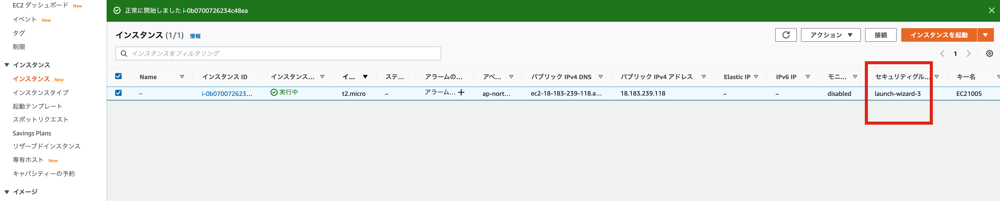
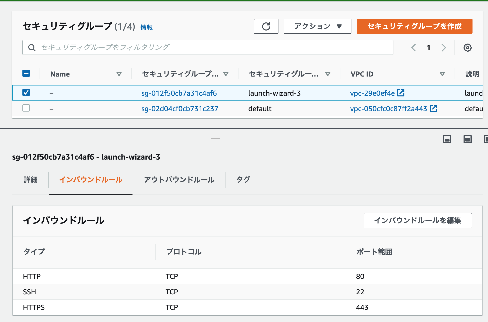
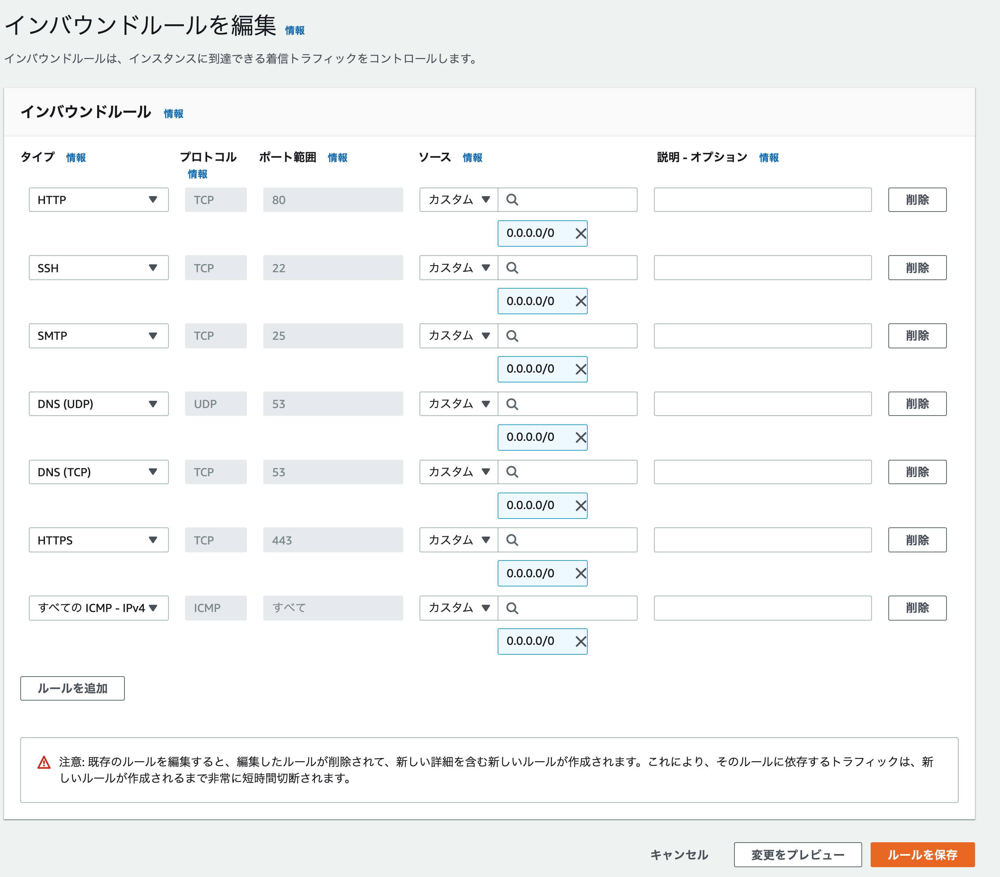
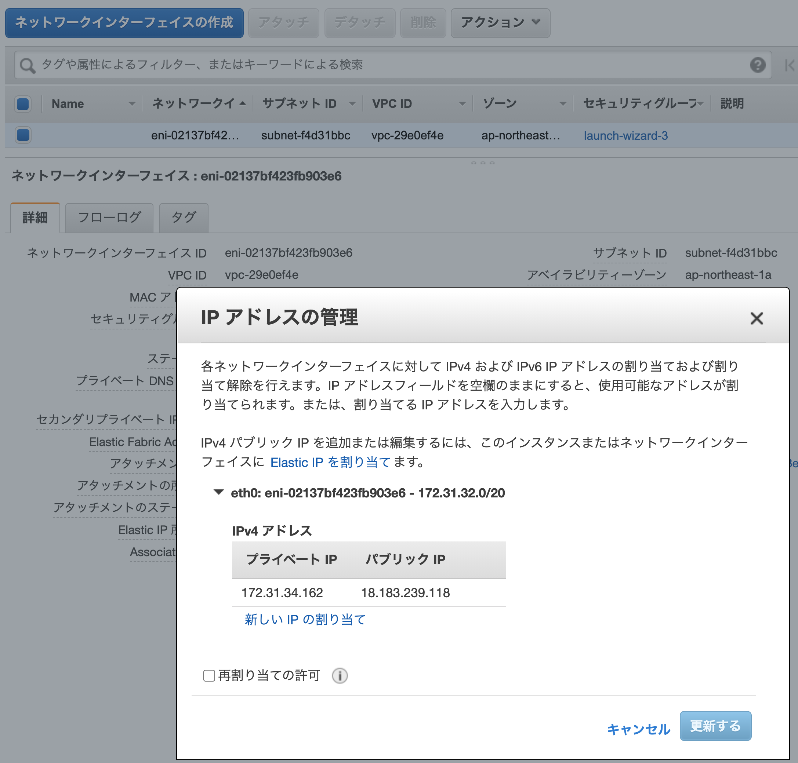

# ネットワークセキュリティ演習
## 5回 ファイアーウォールの構築


### AWSで実施するのでローカルなFWを作成する

### AWS EC2 のセキュリティグループを確認する



### 左のメニュー一覧で「ネットワーク & セキュリティ」のセキュリティグループを選択

起動中のEC2インスタンスのセキュリティグループを選択する



### インバウンドルールを編集

* インバウンドルールのバブを選択
* インバウンドルールを編集ボタン
	* HTTP, SSH, SMTP, DNS(UDP),DNS(TCP),HTTPS, ICMP-IPv4 を許可する




## 確認

### ping

```bash
ping <IPアドレス>
```


### アウトバウンドルールを確認

すべてのトラフィックになっている

### AWS EC2 インスタンスのグローバルIPアドレスの確認

* ▼ネットワーク& セキュリティの　ネットワーク・インターフェース

#### アクションボタン　メニューで「IPアドレスの管理」


　　
#### 自分のIPのアドレスをメモしてください


## iptabelsの確認

```
sudo iptables -L
```

### ルールの削除とユーザチェーンの消去

```
sudo iptables -F
sudo iptables -X

sudo -t nat iptables -F
sudo -t nar iptables -X
```

### 確認

```
sudo iptables -L

sudo iptables -t nat -L

```


## webサーバのセットアップ

### apache2のインストールの確認

* とりあえずインストールしてみる

```bash
sudo apt install -y apache2
```

### webサーバのwebページを作成する

* webサーバマシンのindex.htmlファイルを修正


```
sudo nano /var/www/html/index.html
```

```html
<meta charset="UTF-8">
<html>
<head></head>
<body>
<h1>やまさきのAWS webサーバ
</body>
</html>
```

### 確認内容

* ローカルでのブラウザからページが見えること

## mail サーバのセットアップ

### postfixのインストール


```bash
sudo apt install -y postfix
```

画面が出たら「インターネットサイト」を選択


#### mailコマンドのインストール

```bash
sudo apt install bsd-mailx
```

#### mailコマンドの確認


mail コマンドでメールを出してみる

```
mail kindai@localhost
Subject: test
test mail
.
Cc:
```

#### mailコマンドでメールを受信する

```
mail

Mail version 8.1.2 01/15/2001.  Type ? for help.
"/var/mail/hogeuser": 1 message 1 new
>N  1 hogeuser@sample.com   Fri Mar 24 12:32   14/429   test
& 1
Message 1:
From hogeuser@sample.com  Fri Mar 24 12:32:48 2017
X-Original-To: hogeuser@localhost
To: hogeuser@localhost
Subject: test
Date: Fri, 24 Mar 2017 12:32:48 +0900 (JST)
From: hogeuser@sample.com (hogeuser)

test mail

& q
Saved 1 message in /home/hogeuser/mbox

```


## C言語

### 変数宣言の確認


* 整数型の変数aを宣言する

```bash
nano integer.c
```

```c
#include <stdio.h>
int main(void)
{
  int a;
  a=100;
  return 0;
}
```

```bash
clang integer.c
```

```bash
./a.out
```

### printf文による出力


integer.c

```c
#include <stdio.h>
int main(void)
{
  int a;
  a=100;
  printf("%d",a);
  return 0;
}
```

```bash
clang integer.c
```

```bash
./a.out
```

### 出力を改行する

integer.c

```c
#include <stdio.h>
int main(void)
{
  int a;
  a=100;
  printf("%d\n",a);
  return 0;
}
```

```bash
clang integer.c
```

```bash
./a.out
```


### 変数宣言と代入を一度にやる

integer.c

```c
#include <stdio.h>
int main(void)
{
  int a=100;
  printf("%d\n",a);
  return 0;
}
```

```bash
clang integer.c
```

```bash
./a.out
```

### アドレス演算子を利用して変数のアドレスを得る

```bash
nano address.c
```

```c
#include <stdio.h>
int main()
{
int a=100;
printf("%p\n",&a);
return 0;
}

```

```bash
clang address.c
```

```bash
./a.out
```

### ポインタと間接演算子

```bash
nano pointer.c
```


```c
#include <stdio.h>
int main()
{
  int a = 100;
  int *p;
  p = &a;  /* ポインタpに変数aのアドレスを代入する*/
  printf("%d\n", *p);
  return 0;
}
```

```bash
clang pointer.c
```

```bash
./a.out
```


### ポインタ変数が指すオブジェクトの変更


 pointer.c
 
 ```c
 #include <stdio.h>
int main(){
    int a = 100;
    int b = 500;
    int *p;
    p = &a;
    printf("%d\n", *p);
    p = &b;
    printf("%d\n", *p);
    return 0;
}

 ```


### コマンドライン引数

```bash
nano kodama.c
```


```c
#include <stdio.h>
int main(int argc, char *argv[])
{
  puts(argv[1]);
  return 0;
}
```

* コンパイル

```bash
clang -o kodama kodama.c
```

* 実行


```bash
./kodama hello
```

### C言語の配列


array.c

```c
#include <stdio.h>
int main(){
  int a[3];
  a[0]=10;
  a[1]=20;
  a[2]=30;
  printf("a[0]=%d,a[1]=%d,a[2]=%d\n",a[0],a[1],a[2]);
  return 0;
}

```

### ポインタとしての配列

```c
#include <stdio.h>
int main(){
  int a[3];
  int *p;
  p=&a[0];
  a[0]=10;
  a[1]=20;
  a[2]=30;
  printf("*p=%d\n",*p);
  return 0;
}
```

### 配列変数はポインタ変数

```c
#include <stdio.h>
int main(){
  int a[3];
  int *p;
  p=a;
  a[0]=10;
  a[1]=20;
  a[2]=30;
  printf("*p=%d\n",*p);
  return 0;
}

```

### C言語の文字列は文字の配列

```c
#include <stdio.h>
int main(){
  char *aisatu;
  aisatu="hello";
  puts(aisatu);
  return 0;
}

```

### コマンドライン引数の配列

```c
#include <stdio.h>
int main(int argc, char *argv[]){
  printf("argc: %d\n",argc);
  for(int i; i<argc ; ++i){
    printf("argv: %s\n",argv[i]);
  }
}

```

### ポインタのポインタ

```c
#include <stdio.h>
int main(void){
    int a = 0;
    int *p;   /*整数へのポインタ*/
    int **pp; /*整数へのポインタのポインタ*/
    p=&a;
    pp=&p;
    printf("**pp=%d\n", **pp);
    return 0;
}

```

