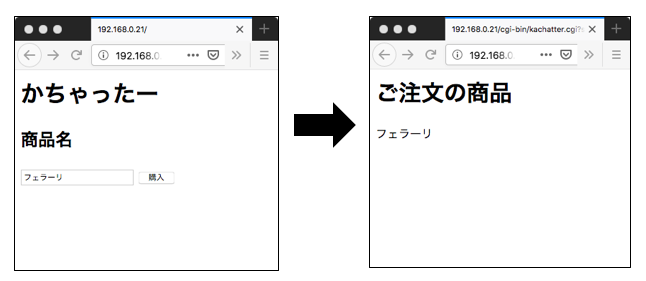
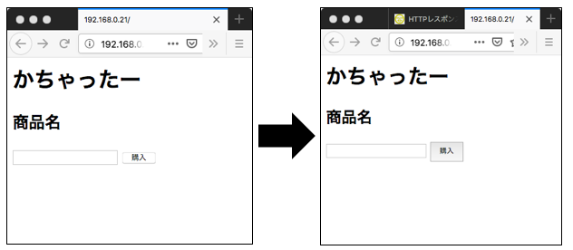
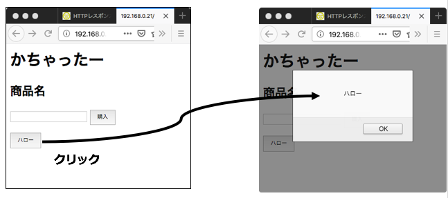
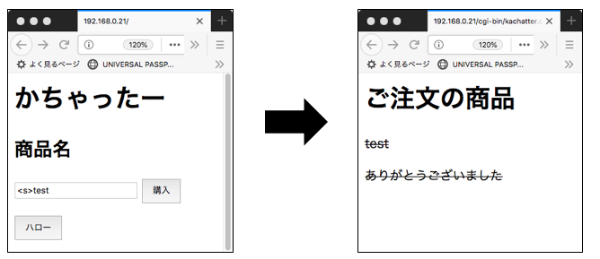
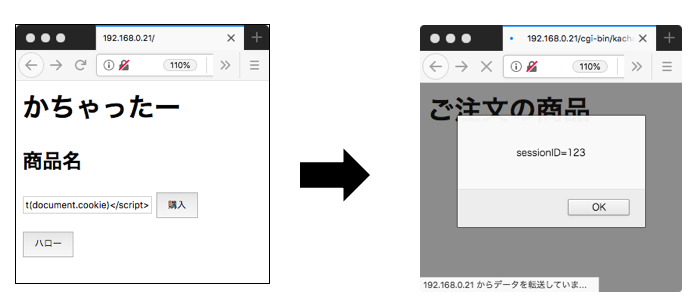
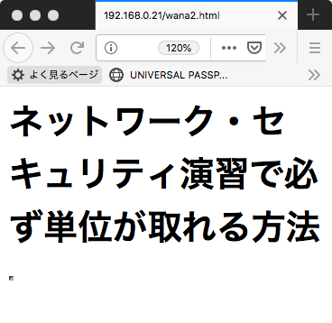

# ネットワークセキュリティ演習
## 8回 Webセキュリティ1

* [レポート](https://forms.gle/gw1qRRVM5KmoqJkCA)

## 必要なソフトのインストール

###  apache2

```bash
sudo apt install apache2
```

### CGIの有効化設定

```bash
sudo a2enmod cgid
```

### apache2の再起動

```bash
sudo systemctl restart apache2
```

### 自分のマシンのIPアドレスを確認

```bash
ip addr
```

各自IPアドレスをメモする

## HTMLファイルの作成

### index.htmlの編集

ドキュメントルート

	/var/www/html/
	
index.html ファイル編集

```bash
sudo nano /var/www/html/index.html
```

```html
<meta http-equiv="content-type" charset="utf-8">
<html>
 <head></head>
 <body>
 <h1>かちゃったー</h1>
 <form method="GET" action="/cgi-bin/kachatter.cgi">
 <h2>商品名</h2>
 <input type="text" name="shohin">
 <input type="submit" value="購入">
 </form>
 </body>
</html>
```

### ブラウザからURLを入れてwebページを確認する

URL

```url
http://192.168.1.xx/
```

## CGIファイルを作成

スクリプトエイリアス

	/usr/lib/cgi-bin/
	
kachatter.cgi ファイル編集

```bash
sudo nano /usr/lib/cgi-bin/kachatter.cgi
```

```ruby
#!/usr/bin/env ruby
require 'cgi'
cgi=CGI.new
print "Content-Type: text/html"
print "\n\n"
print <<-EOM
<meta http-equiv="content-type" charset="utf-8">
<html>
 <head></head>
<body>
  <h1>ご注文の商品</h1>
  <p>#{cgi['shohin']}</p>
  <p>ありがとうございました</p>
</body>
</html> 
EOM
```

### CGIファイルに実行権限を与える

```bash
sudo chmod a+x /usr/lib/cgi-bin/kachatter.cgi
```

## 動的webページの確認

### ブラウザからURLを入れてwebページを確認する

URL

```url
http://192.168.1.xx/
```




### CSSでボタンのスタイルを修正

```bash
sudo nano /var/www/html/index.html
```

```html
<meta http-equiv="content-type" charset="utf-8">
<html>
  <head>
    <style type="text/css">
     .btn {line-height:2.5;}
    </style>
  </head>
  <body>
    <h1>かちゃったー</h1>
    <form method="GET" action="/cgi-bin/kachatter.cgi">
       <h2 id='title2'>商品名</h2>
       <p><input type="text" name="shohin"></p>
       <p><input type="submit" class="btn" value="購入"></p>
     </form>
  </body>
</html>
```

### ブラウザで確認




### javaScript を使った要素

ボタンクリックでアラートがポップアップするようにする

```bash
sudo nano /var/www/html/index.html
```

```html
<meta http-equiv="content-type" charset="utf-8">
<html>
  <head>
  <style type="text/css">
   .btn {line-height:2.5;}
  </style>
  <script>
function hello(){
  alert("ハロー");
}
  </script>
  </head>
  <body>
    <h1>かちゃったー</h1>
    <form method="GET" action="/cgi-bin/kachatter.cgi">
      <h2 id='title2'>商品名</h2>
        <p><input type="text" name="shohin"></p>
        <p><input type="submit" class="btn" value="購入"></p>
        <p><input type="button" class="btn" value="ハロー" onclick="hello()"></p>
      </form>
  </body>
</html>
```

### ブラウザで確認



### javascriptでDOM要素を取り出す

h2のコンテナの内容を getElementById(DOM要素のID).textContent で取り出す


```bash
sudo nano /var/www/html/index.html
```

```html
<meta http-equiv="content-type" charset="utf-8">
<html>
  <head>
    <style type="text/css">
     .btn {line-height:2.5;}
    </style>
  <script>
function hello(){
        var obj=document.getElementById('title2');
        alert(obj.textContent);}
  </script>
  </head>
  <body>
    <h1>かちゃったー</h1>
    <form method="GET" action="/cgi-bin/kachatter.cgi">
      <h2 id='title2'>商品名</h2>
      <p><input type="text" name="shohin"></p>
      <p><input type="submit" class="btn" value="購入"></p>
      <p><input type="button" class="btn" value="ハロー" onclick="hello()"></p>
    </form>
  </body>
</html>
```

DOM要素のコンテナを確認


### javascriptでDOM要素を書き換える

 getElementById(DOM要素のID).textContent でh2のコンテナを書き換える


```bash
sudo nano /var/www/html/index.html
```

```html
<meta http-equiv="content-type" charset="utf-8">
<html>
  <head>
  <style type="text/css">
   .btn {line-height:2.5;}
  </style>
  <script>
function hello(){
        var obj=document.getElementById('title2');
        obj.textContent='買ったもの';}
  </script>
  </head>
  <body>
    <h1>かちゃったー</h1>
    <form method="GET" action="/cgi-bin/kachatter.cgi">
      <h2 id='title2'>商品名</h2>
        <input type="text" name="shohin">
        <input type="submit" class="btn" value="購入">
        <p><input type="button" class="btn" value="ハロー" onclick="hello()"></p>
      </form>
  </body>
</html>
```

DOM要素のコンテナを更新


### クッキーにセッションIDを記録

login.html というページを作成

```bash
sudo nano /var/www/html/login.html
```

javascriptでクッキーに sessionID=123 という内容を埋め込む


```html
<meta http-equiv="content-type" charset="utf-8">
<html>
  <head>
    <style type="text/css">
      .btn {line-height:2.5;}
    </style>
    <script>
      function login(){document.cookie='sessionID=123';}
    </script>
  </head>
  <body>
    <h1>セッション確立</h1>
    <form method="GET" action="/cgi-bin/kachatter.cgi">
      <p><input type="button" class="btn" value="login" onclick="login()"></p>
    </form>
  </body>
</html>
```


## URLによるフォーム入力

ターミナルから curlコマンドで入力

```bash
curl http://192.168.1.xx/cgi-bin/kachatter.cgi?shohin=benz
```

```
<meta http-equiv="content-type" charset="utf-8">
<html>
 <head></head>
<body>
<h1>ご注文の商品</h1>
benz
<p>ありがとうございました</p>
</body>
</html>
```

## クロスサイトスクリプティング

### ブラウザの入力フォームにHTMLを埋め込んでみる





### ブラウザの入力フォームにjavaScriptを埋め込んでみる

```
<script>alert(document.cookie)</script>　

```




## 罠サイトによるiframeによるサイトの埋め込み

wana.html

```bash
sudo nano /var/www/html/wana.html
```

```html
<meta http-equiv="content-type" charset="utf-8">
<html>
  <head>
  </head>
  <body>
    <iframe id="attack"
      width="300"  //iframeの幅（ピクセル）
      height="200" //iframeの高さ（ピクセル）
      src="http://192.168.1.xx/login.html">
    </iframe>
  </body>
</html>
```


## 罠サイトにおける気づきにくいiframeのページ埋め込み

wana2.html

```bash
sudo nano /var/www/html/wana2.html
```

```html
<meta http-equiv="content-type" charset="utf-8">
<html>
  <head>
  </head>
  <body>
    <h1>ネットワーク・セキュリティ演習で必ず単位が取れる方法</h1>
    <iframe id="attack"
            width="1"  //iframeの幅（ピクセル）
            height="1" //iframeの高さ（ピクセル）
            src="http://192.168.0.21/cgi-bin/kachatter.cgi?shohin=benz">
    </iframe>
  </body>
</html>
```




