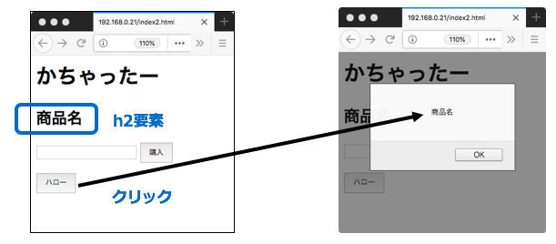
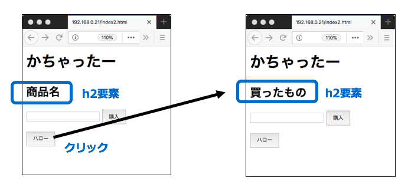
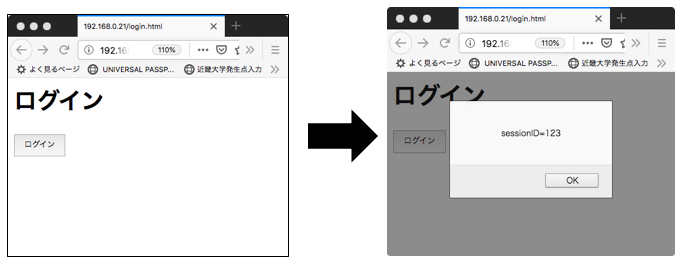
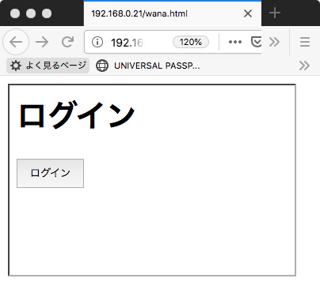

# ネットワークセキュリティ演習
## 8回 Webセキュリティ1

## login

山崎家： 

```bash
ssh <ユーザID>@106.157.214.199
```

## web セキュリティ演習マシンへのログイン

```bash
ssh kindai@192.168.2.1

ssh <ユーザID>@192.168.0.250
```

パスワードは授業で教えます

## HTMLファイルの作成

```bash
cd /var/www/html/<ユーザID>/
```

### index.htmlの編集

ドキュメントルート

	/var/www/html/<ユーザID>/
	
index.html ファイル編集

```bash
nano /var/www/html/<ユーザID>/index.html
```

```html
<meta http-equiv="content-type" charset="utf-8">
<html>
 <head></head>
 <body>
 <h1>かちゃったー</h1>
 <form method="GET" action="/cgi-bin/<ユーザID>/kachatter.cgi">
 <h2>商品名</h2>
 <input type="text" name="shohin">
 <input type="submit" value="購入">
 </form>
 </body>
</html>
```

### ブラウザからURLを入れてwebページを確認する

URL

```url
http://106.157.214.199/<ユーザID>/
```

## CGIファイルを作成

スクリプトエイリアス

```bash
cd	/usr/lib/cgi-bin/<ユーザID>/
```

kachatter.cgi ファイル編集

```bash
nano /usr/lib/cgi-bin/<ユーザID>/kachatter.cgi
```

```ruby
#!/usr/bin/env ruby
require 'cgi'
cgi=CGI.new
print "Content-Type: text/html"
print "\n\n"
print <<-EOM
<meta http-equiv="content-type" charset="utf-8">
<html>
 <head></head>
<body>
  <h1>ご注文の商品</h1>
  <p>#{cgi['shohin']}</p>
  <p>ありがとうございました</p>
</body>
</html> 
EOM
```

### CGIファイルに実行権限を与える

```bash
chmod a+x /usr/lib/cgi-bin/<ユーザID>/kachatter.cgi
```

## 動的webページの確認

### ブラウザからURLを入れてwebページを確認する

URL

```url
http://106.157.214.199/<ユーザID>/
```


### CSSでボタンのスタイルを修正

```bash
nano /var/www/html/<ユーザID>/index.html
```

```html
<meta http-equiv="content-type" charset="utf-8">
<html>
  <head>
    <style type="text/css">
     .btn {line-height:2.5;}
    </style>
  </head>
  <body>
    <h1>かちゃったー</h1>
    <form method="GET" action="/cgi-bin/<ユーザID>/kachatter.cgi">
       <h2 id='title2'>商品名</h2>
       <p><input type="text" name="shohin"></p>
       <p><input type="submit" class="btn" value="購入"></p>
     </form>
  </body>
</html>
```

### ブラウザで確認


### javaScript を使った要素

ボタンクリックでアラートがポップアップするようにする

```bash
nano /var/www/html/<ユーザID>/index.html
```

```html
<meta http-equiv="content-type" charset="utf-8">
<html>
  <head>
  <style type="text/css">
   .btn {line-height:2.5;}
  </style>
  <script>
function hello(){
  alert("ハロー");
}
  </script>
  </head>
  <body>
    <h1>かちゃったー</h1>
    <form method="GET" action="/cgi-bin/<ユーザID>/kachatter.cgi">
      <h2 id='title2'>商品名</h2>
        <p><input type="text" name="shohin"></p>
        <p><input type="submit" class="btn" value="購入"></p>
        <p><input type="button" class="btn" value="ハロー" onclick="hello()"></p>
      </form>
  </body>
</html>
```

### ブラウザで確認


### javascriptでDOM要素を取り出す

h2のコンテナの内容を getElementById(DOM要素のID).textContent で取り出す


```bash
nano /var/www/html/<ユーザID>/index.html
```

```html
<meta http-equiv="content-type" charset="utf-8">
<html>
  <head>
    <style type="text/css">
     .btn {line-height:2.5;}
    </style>
  <script>
function hello(){
        var obj=document.getElementById('title2');
        alert(obj.textContent);}
  </script>
  </head>
  <body>
    <h1>かちゃったー</h1>
    <form method="GET" action="/cgi-bin/<ユーザID>/kachatter.cgi">
      <h2 id='title2'>商品名</h2>
      <p><input type="text" name="shohin"></p>
      <p><input type="submit" class="btn" value="購入"></p>
      <p><input type="button" class="btn" value="ハロー" onclick="hello()"></p>
    </form>
  </body>
</html>
```

DOM要素のコンテナを確認




### javascriptでDOM要素を書き換える

 getElementById(DOM要素のID).textContent でh2のコンテナを書き換える


```bash
nano /var/www/html/<ユーザID>/index.html
```

```html
<meta http-equiv="content-type" charset="utf-8">
<html>
  <head>
  <style type="text/css">
   .btn {line-height:2.5;}
  </style>
  <script>
function hello(){
        var obj=document.getElementById('title2');
        obj.textContent='買ったもの';}
  </script>
  </head>
  <body>
    <h1>かちゃったー</h1>
    <form method="GET" action="/cgi-bin/<ユーザID>/kachatter.cgi">
      <h2 id='title2'>商品名</h2>
        <input type="text" name="shohin">
        <input type="submit" class="btn" value="購入">
        <p><input type="button" class="btn" value="ハロー" onclick="hello()"></p>
      </form>
  </body>
</html>
```

DOM要素のコンテナを更新



### クッキーにセッションIDを記録

login.html というページを作成

```bash
nano /var/www/html/<ユーザID>/login.html
```

javascriptでクッキーに sessionID=123 という内容を埋め込む


```html
<meta http-equiv="content-type" charset="utf-8">
<html>
<head>
<style type="text/css">
.btn {line-height:2.5;}
</style>
<script>
function login(){
document.cookie='sessionID=123';
alert(document.cookie);
}
</script>
</head>
<body>
<h1>セッション確立</h1>
<form method="GET" action="/cgi-bin/<ユーザID>/kachatter.cgi">
<p><input type="button" class="btn" value="login" onclick="login()"></p>
</form>
</body>
</html>


```



## URLによるフォーム入力

ターミナルから curlコマンドで入力

```bash
curl http://106.157.214.199/cgi-bin/<ユーザID>/kachatter.cgi?shohin=benz
```

```
<meta http-equiv="content-type" charset="utf-8">
<html>
 <head></head>
<body>
<h1>ご注文の商品</h1>
benz
<p>ありがとうございました</p>
</body>
</html>
```

## クロスサイトスクリプティング

### ブラウザの入力フォームにHTMLを埋め込んでみる


### ブラウザの入力フォームにjavaScriptを埋め込んでみる

```
<script>alert(document.cookie)</script>　

```


## 罠サイトによるiframeによるサイトの埋め込み

wana.html

```bash
nano /var/www/html/<ユーザID>/wana.html
```

```html
<meta http-equiv="content-type" charset="utf-8">
<html>
  <head>
  </head>
  <body>
    <iframe id="attack"
      width="300"  //iframeの幅（ピクセル）
      height="200" //iframeの高さ（ピクセル）
      src="http://106.157.214.199/<ユーザID>/login.html">
    </iframe>
  </body>
</html>
```




## 罠サイトにおける気づきにくいiframeのページ埋め込み

wana2.html

```bash
nano /var/www/html/<ユーザID>/wana2.html
```

```html
<meta http-equiv="content-type" charset="utf-8">
<html>
  <head>
  </head>
  <body>
    <h1>ネットワーク・セキュリティ演習で必ず単位が取れる方法</h1>
    <iframe id="attack"
            width="1"  //iframeの幅（ピクセル）
            height="1" //iframeの高さ（ピクセル）
            src="http://106.157.214.199/cgi-bin/<ユーザID>/kachatter.cgi?shohin=benz">
    </iframe>
  </body>
</html>
```


----------------------------
## 必要なソフトのインストール（今回は事前にやっているので不要）

###  apache2

```bash
sudo apt install -y apache2
```

### CGIの有効化設定

```bash
sudo a2enmod cgid
```

### apache2の再起動

```bash
sudo systemctl restart apache2
```

### 自分のマシンのIPアドレスを確認

```bash
ip addr
```

各自IPアドレスをメモする


## サーバ側でセッションIDを生成してクッキーに入れる方法

### セッション開始ページ


```bash
cd /var/www/html/<ユーザID>/
```

```bash
sudo nano /var/www/html/<ユーザID>/session.html
```

```html
<meta http-equiv="content-type" charset="utf-8">
<html>
 <head></head>
 <body>
 <h1>山崎サーバ</h1>
  <h2>セッション</h2>
 <form method="GET" action="/cgi-bin/<ユーザID>/session.cgi">
 <p><input type="submit" value="セッション開始"></p>
 </form>
 </body>
</html>
```

###  サーバ側でセッションIDを生成

```bash
sudo nano /usr/lib/cgi-bin/<ユーザID>/session.cgi
```
安全な乱数でセッションIDを生成する

```ruby
#!/usr/bin/env ruby
# coding: utf-8
require 'cgi'
require 'securerandom'
cgi=CGI.new

puts "Content-Type: text/html;"
puts "Set-Cookie: sessionid=#{SecureRandom.hex(32)}; path=/"
puts "\n\n"
  print <<-EOM
  <meta http-equiv="content-type" charset="utf-8">
  <html><head>
    <script>
      function info(){alert(document.cookie);}
    </script>
  </head><body>
   <h1>山崎サーバ</h1>
  <h2>セッション確立</h2>
<form method='GET' action='/cgi-bin/<ユーザID>/service.cgi'> 
  <input type='button' value="cookie" onclick="info();">
  <input type='submit' value="サービス">
</form>
</body></html>
EOM

```

### サービス継続

```bash
sudo nano /usr/lib/cgi-bin/<ユーザID>/service.cgi
```

```ruby
#!/usr/bin/env ruby                                                             
# coding: utf-8                                                                 
require 'cgi'
cgi=CGI.new
cookies=ENV['HTTP_COOKIE'].split(/;\s/).map{|x|x.split('=')}.to_h

puts "Content-Type: text/html;"
puts "Set-Cookie: sessionid=#{cookies["sessionid"]}; path=/"
puts "\n\n"
  print <<-EOM                                                                  
  <meta http-equiv="content-type" charset="utf-8">                              
  <html><head>                                                                  
    <script>                                                                    
      function info(){alert(document.cookie);}                                  
    </script>                                                                   
  </head><body>
   <h1>山崎サーバ</h1>                                                                 
  <h2>セション継続中</h2>                                                       
<p>sessionid=#{cookies["sessionid"]}</p>                                        
<form method='GET' action='/cgi-bin/service.cgi'>                               
<input type='button' value="cookie" onclick="info();">                          
<input type='submit' value="サービス継続">                              
</form>                                                                         
  </body></html>                                                                
EOM
```

