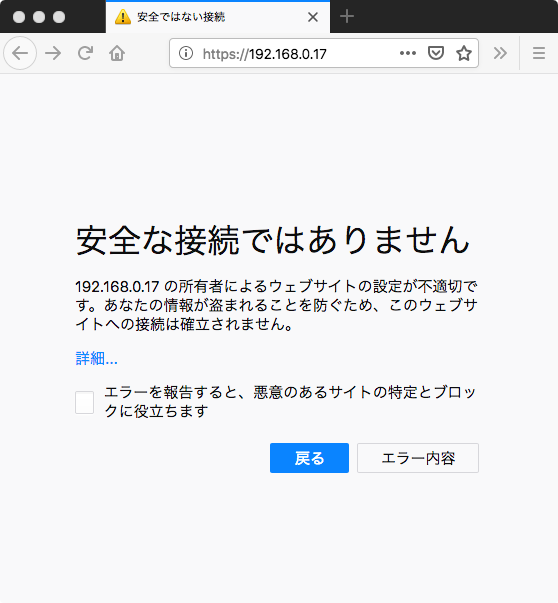

# ネットワークセキュリティ演習
## 11回  SSL/TSL

### 演習レポートのURL

[https://goo.gl/forms/36KUB7SlY9tQmDqa2](https://goo.gl/forms/36KUB7SlY9tQmDqa2)

## openssl で電子署名を作成する

自分の公開鍵証明書、秘密鍵が存在するディレクトリに移動

自分の公開鍵証明書と秘密鍵、CAの公開鍵証明書を確認

```bash
cd ~/cert
ls

cacert.pem  yamasaki.csr yamasaki.crt  yamasaki.key
```

### 電子署名を行う

openssl のsmime コマンドを利用する

```
openssl smime -sign -in メッセージ -signer 証明書  -inkey 署秘密鍵 -out 署名データ

```

メッセージの作成

```
nano message.txt
```

```
これは署名対象のメッセージです
```

### 電子署名の作成

* 署名者： 自分の公開鍵証明書ファイル
* 署名秘密鍵： 自分の秘密鍵のファイル
* 出力ファイル：PKCS#7形式

```bash
openssl smime -sign -signer yamasaki.crt -inkey yamasaki.key -in message.txt -out message.p7
```

★ 以下のエラーメッセージはとりあえず無視してよい

	unable to write 'random state'

### 署名結果の確認

```
cat message.p7
```

メッセージ自体と電子署名関連ファイルを確認する

### 署名の検証

```
openssl smime -verify -in 署名データ  -recip 証明書  -noverify
```

★  -noverify は、CAの証明書まで遡らないという意味

実行例

```bash
openssl smime -verify -in message.p7 -recip yamasaki.crt -noverify
これはメッセージです

Verification successful
```

### メッセージの暗号化

* 暗号鍵： 暗号化する公開鍵証明書ファイル（暗号文の宛先）
* AES128で暗号化

```bash
openssl smime -encrypt -aes128 -in メッセージ  -out 暗号文  公開鍵証明書
```

実行例

```bash
openssl smime -encrypt -aes128 -in message.txt  -out message.enc yamasaki.crt
```

### メッセージの復号化

```
openssl smime -decrypt -recip 暗号化公開鍵証明書 -inkey 復号化の秘密鍵 -in 暗号文
```

実行例

```bash
openssl smime -decrypt -recip yamasaki.crt -inkey yamasaki.key -in message.enc 

これはメッセージです
```

## TLSサーバの構築

### apache2 へのTLSの設定

```bash
sudo a2enmod ssl

sudo] kindai のパスワード: 
Considering dependency setenvif for ssl:
Module setenvif already enabled
Considering dependency mime for ssl:
Module mime already enabled
Considering dependency socache_shmcb for ssl:
Enabling module socache_shmcb.
Enabling module ssl.
See /usr/share/doc/apache2/README.Debian.gz on how to configure SSL and create self-signed certificates.
To activate the new configuration, you need to run:
  systemctl restart apache2
```

```bash
sudo a2ensite default-ssl
```

### apache2 の再起動

```bash
sudo  systemctl reload apache2
```

### ポート番号の確認

```
ss -lnt

State     Recv-Q     Send-Q          Local Address:Port          Peer Address:Port     
LISTEN    0          128             127.0.0.53%lo:53                 0.0.0.0:*        
LISTEN    0          128                   0.0.0.0:22                 0.0.0.0:*        
LISTEN    0          5                   127.0.0.1:631                0.0.0.0:*        
LISTEN    0          80                  127.0.0.1:3306               0.0.0.0:*        
LISTEN    0          128                      [::]:22                    [::]:*        
LISTEN    0          5                       [::1]:631                   [::]:*        
LISTEN    0          128                         *:443                      *:*        
LISTEN    0          128                         *:80                       *:*        

```

## TLSサーバの公開鍵証明書の発行

### DNの設計

* TLS サーバのCNは、FQDN
	ドメイン名が無い場合は、IPアドレス
	他は、CAと同じにする
* 管理者の電子メールアドレス

* 国＝日本の
	* C＝JP
* 州県＝福岡県の
	*  ST=Fukuoka
* 市＝飯塚市の
	* L=Iizuka
* 組織＝近畿大学の
	* O=Kindai University
* 部署＝産業理工学部
	* OU=Faculty of Humanity Oriented Science and Engineering
* 標準名＝TLSサーバのドメイン名（IPアドレス）
	* CN=192.168.1.xx

### RSA鍵の生成

```bash
openssl genrsa 2048 > server.key
```
### CSRの生成

```bash
openssl req -new -key server.key -out server.csr
```

##  証明書リクエストファイル (CSR) をCAに渡す
  
  demoCAのディレクトリにコピーするだけ
  
```
sudo cp server.csr /usr/lib/ssl/misc/
```
  
## CA として公開鍵証明書を作成する

CAのディレクトリに移動

```bash
cd /usr/lib/ssl/misc/
```

リクエストファイルを確認する

```bash
ls

server.csr
```

### CAとしてCSRに電子署名を行い、公開鍵証明書 （CRT)を作成する

```bash
sudo openssl ca -in server.csr -out server.crt
```

yesを２回入力すると成功

同じDNの証明書は再度作成できないので注意

### 公開鍵証明書の確認

```bash
openssl x509 -text -in server.crt 
```
発行者、主体名、有効期間、鍵の長さ、CAになれるか、などを確認

```
openssl x509 -text -in server.crt 
Certificate:
    Data:
        Version: 3 (0x2)
        Serial Number:
            b6:72:ba:d7:a7:f1:d1:19
    Signature Algorithm: sha256WithRSAEncryption
        Issuer: C = JP, ST = Fukuoka, O = Kindai University, OU = Faculty of Humanity Oriented Science and Engineering, CN = Kindai CA
        Validity
            Not Before: Dec  2 08:47:47 2018 GMT
            Not After : Dec  2 08:47:47 2019 GMT
        Subject: C = JP, ST = Fukuoka, O = Kindai University, OU = Faculty of Humanity Oriented Science and Engineering, CN = 192.168.0.17
        Subject Public Key Info:
            Public Key Algorithm: rsaEncryption
                Public-Key: (2048 bit)
                Modulus:
                    00:a2:6b:5d:1b:0f:b9:d3:cd:10:da:ca:88:f0:98:
                    a6:bf:08:bf:ed:22:83:4f:2b:6f:3e:59:c6:2f:33:
                    3b:de:12:3e:8f:57:6a:bc:82:24:9d:82:36:fe:f0:
                    e3:ca:69:15:3b:7d:bf:c6:7e:6a:7a:94:7c:41:09:
                    1c:a8:c4:5a:a1:78:6d:79:0c:9d:33:00:61:6a:bf:
                    1d:94:95:79:01:67:1b:5f:7e:45:a5:3b:f3:cf:56:
                    9c:7f:db:9a:23:98:3a:5f:68:d8:bf:06:9f:a6:31:
                    26:6a:c7:92:ef:66:ff:fe:d7:54:87:16:51:b9:60:
                    e2:f7:4e:38:0b:36:95:e8:de:1f:a0:bd:c8:a0:6c:
                    e0:3e:db:f0:7e:b7:39:e5:78:86:af:4b:0d:4f:1a:
                    66:69:38:0e:9a:f4:67:7b:27:c4:4b:8a:65:27:c4:
                    74:d6:ab:87:a4:8c:9a:8f:ad:80:fd:86:c7:d1:10:
                    0c:be:d4:82:e2:e3:ef:e8:af:16:cd:6c:25:1f:d8:
                    7d:81:cf:20:bb:55:1d:f7:3d:93:f3:28:41:b5:19:
                    0c:ba:2f:69:2a:db:0f:13:b7:dd:d8:be:73:64:c8:
                    9e:a4:d0:d1:4b:be:a3:36:36:58:61:f7:e1:c4:01:
                    d6:67:52:89:79:fc:15:95:c8:bc:05:19:13:24:c9:
                    8f:f7
                Exponent: 65537 (0x10001)
        X509v3 extensions:
            X509v3 Basic Constraints: 
                CA:FALSE
            Netscape Comment: 
                OpenSSL Generated Certificate
            X509v3 Subject Key Identifier: 
                B4:8C:37:01:DD:BD:DA:69:14:B4:42:5B:80:BB:CF:51:AF:D3:10:16
            X509v3 Authority Key Identifier: 
                keyid:01:72:21:52:AF:00:EB:68:CF:AB:65:D1:54:FC:7E:AF:6A:A6:A0:89

    Signature Algorithm: sha256WithRSAEncryption
         0e:da:90:fd:ec:50:9c:f5:27:05:68:dd:b5:8a:99:bb:15:77:
         09:68:9e:8e:09:20:c5:99:c9:13:7b:3f:d5:3b:ec:d7:e8:dd:
         b6:e0:16:2d:e0:06:4f:9f:23:80:09:65:b8:80:8d:b7:df:c8:
         b0:f9:84:80:ba:6a:46:ad:73:51:63:83:d9:0b:60:c3:97:a1:
         a4:0d:e9:6f:17:43:ef:38:33:8f:4b:8d:03:44:8e:25:c0:61:
         37:b6:60:2c:65:49:e6:0d:13:58:fc:42:48:18:f7:36:14:f0:
         36:70:62:77:74:a8:32:9e:67:6b:b6:bb:77:68:36:cf:9d:6b:
         c5:da:41:69:fc:aa:1c:9e:16:28:70:d6:61:84:63:e2:7a:14:
         05:66:6e:71:47:42:3c:0a:a6:64:1c:7e:1a:c9:35:ec:78:8d:
         f0:32:e6:f9:aa:7f:fa:98:ed:c4:62:78:cb:20:7b:19:8a:31:
         1e:55:dd:cf:01:84:0f:05:51:59:6d:91:fb:3a:64:b0:71:b4:
         d2:69:8b:82:35:ba:a6:8d:b1:38:37:57:c2:18:81:bc:3d:20:
         93:6a:9a:df:68:6d:77:08:64:82:0b:81:96:fa:a6:19:ca:c2:
         3a:ec:a4:c1:c0:3f:df:db:6e:66:07:00:b1:92:2a:bc:4a:11:
         11:f0:54:46
-----BEGIN CERTIFICATE-----
MIIEHzCCAwegAwIBAgIJALZyuten8dEZMA0GCSqGSIb3DQEBCwUAMIGOMQswCQYD
VQQGEwJKUDEQMA4GA1UECAwHRnVrdW9rYTEaMBgGA1UECgwRS2luZGFpIFVuaXZl
cnNpdHkxPTA7BgNVBAsMNEZhY3VsdHkgb2YgSHVtYW5pdHkgT3JpZW50ZWQgU2Np
ZW5jZSBhbmQgRW5naW5lZXJpbmcxEjAQBgNVBAMMCUtpbmRhaSBDQTAeFw0xODEy
MDIwODQ3NDdaFw0xOTEyMDIwODQ3NDdaMIGRMQswCQYDVQQGEwJKUDEQMA4GA1UE
CAwHRnVrdW9rYTEaMBgGA1UECgwRS2luZGFpIFVuaXZlcnNpdHkxPTA7BgNVBAsM
NEZhY3VsdHkgb2YgSHVtYW5pdHkgT3JpZW50ZWQgU2NpZW5jZSBhbmQgRW5naW5l
ZXJpbmcxFTATBgNVBAMMDDE5Mi4xNjguMC4xNzCCASIwDQYJKoZIhvcNAQEBBQAD
ggEPADCCAQoCggEBAKJrXRsPudPNENrKiPCYpr8Iv+0ig08rbz5Zxi8zO94SPo9X
aryCJJ2CNv7w48ppFTt9v8Z+anqUfEEJHKjEWqF4bXkMnTMAYWq/HZSVeQFnG19+
RaU7889WnH/bmiOYOl9o2L8Gn6YxJmrHku9m//7XVIcWUblg4vdOOAs2lejeH6C9
yKBs4D7b8H63OeV4hq9LDU8aZmk4Dpr0Z3snxEuKZSfEdNarh6SMmo+tgP2Gx9EQ
DL7UguLj7+ivFs1sJR/YfYHPILtVHfc9k/MoQbUZDLovaSrbDxO33di+c2TInqTQ
0Uu+ozY2WGH34cQB1mdSiXn8FZXIvAUZEyTJj/cCAwEAAaN7MHkwCQYDVR0TBAIw
ADAsBglghkgBhvhCAQ0EHxYdT3BlblNTTCBHZW5lcmF0ZWQgQ2VydGlmaWNhdGUw
HQYDVR0OBBYEFLSMNwHdvdppFLRCW4C7z1Gv0xAWMB8GA1UdIwQYMBaAFAFyIVKv
AOtoz6tl0VT8fq9qpqCJMA0GCSqGSIb3DQEBCwUAA4IBAQAO2pD97FCc9ScFaN21
ipm7FXcJaJ6OCSDFmckTez/VO+zX6N224BYt4AZPnyOACWW4gI2338iw+YSAumpG
rXNRY4PZC2DDl6GkDelvF0PvODOPS40DRI4lwGE3tmAsZUnmDRNY/EJIGPc2FPA2
cGJ3dKgynmdrtrt3aDbPnWvF2kFp/KocnhYocNZhhGPiehQFZm5xR0I8CqZkHH4a
yTXseI3wMub5qn/6mO3EYnjLIHsZijEeVd3PAYQPBVFZbZH7OmSwcbTSaYuCNbqm
jbE4N1fCGIG8PSCTaprfaG13CGSCC4GW+qYZysI67KTBwD/f225mBwCxkiq8ShER
8FRG
-----END CERTIFICATE-----
```

## CAから申請者に完成した公開鍵証明書を渡す

証明書をCAのディレクトリから個人のディレクトリにコピーするだけ

```bash
cp server.crt ~/cert/
```


## 自分本人のディレクトリに移動

```bash
cd ~/cert
```

```bash
ls

cacert.pem  server.crt  server.key server.csr  ...
```

CAの公開鍵証明書、TLSサーバの公開鍵証明書、TLSサーバの秘密鍵、などがあることを確認
  
### TLSサーバ証明書の確認

 CAの公開鍵証明書をつかって自分の公開鍵証明書が正統なものであることを確認する

```
openssl verify -CAfile cacert.pem server.crt

server.crt: OK
```

## TLS公開鍵証明書とCA署名書をapacheに組み込む

### apacheのssl設定ファイルの修正

```bash
cd /etc/apache2/sites-enabled/
```

```bash
ls

000-default.conf  default-ssl.conf
```

apacheのssl設定ファイルの編集

```bash
sudo nano /etc/apache2/sites-enabled/default-ssl.conf
```

設定ファイルの修正箇所

* サーバ証明書のファイル名を server.crt にする
* サーバ秘密鍵のファイル名を server.key にする
* サーバ証明書検証チェーンのCAを cacert.pem にする

★注意： SSLCertificateFile、SSLCertificateKeyFile、SSLCertificateChainFile が他に無いか確認する

```
    ...
    
                SSLCertificateFile    /etc/ssl/certs/server.crt
                SSLCertificateKeyFile /etc/ssl/private/server.key
                
                #SSLCertificateKeyFile /etc/ssl/private/ssl-cert-snakeoil.key
                #   Server Certificate Chain:
                #   Point SSLCertificateChainFile at a file containing the
                #   concatenation of PEM encoded CA certificates which form the
                #   certificate chain for the server certificate. Alternatively
                #   the referenced file can be the same as SSLCertificateFile
                #   when the CA certificates are directly appended to the server
                #   certificate for convinience.
                
                SSLCertificateChainFile /etc/apache2/ssl.crt/cacert.pem   
                
                #   Certificate Authority (CA):
                #   Set the CA certificate verification path where to find CA
                #   certificates for client authentication or alternatively one
   
```

### 自分の証明書ディレクトリに復帰

```bash
cd ~/cert
```

### サーバ公開鍵証明書を組み込む

``
server.crt を /etc/ssl/certs/ ディレクトリにコピーする
``

```bash
sudo cp server.crt /etc/ssl/certs/
```

### サーバ秘密鍵を組み込む

``
server.key を/etc/ssl/private/ ディレクトリにコピーする
``

```bash
sudo cp server.key /etc/ssl/private/
```
### サーバ証明書検証チェーンのCAを組み込む

``
/etc/apache2/ssl.crt/ ディレクトリを作成する
``

```bash
sudo mkdir /etc/apache2/ssl.crt/

sudo cp cacert.pem /etc/apache2/ssl.crt/
```


## TLSサーバを再起動する

```bash
sudo service apache2 restart
```

## ブラウザでサーバにアクセスする

``
https://192.168.0.17/signup.html
``
### ブラウザのエラー表示



### CA証明書をブラウザに組み込む

1. firefoxの「設定」を開く
2. 「ブラウザプライバシー」
3. 設定画面の一番下の右側の 「証明書を表示...」 
4. 「認証局証明書」のタブを選ぶ
5. 「読み込む」ボタンをクリック
6. homeディレクトリの下のcertディレクトリの下にある cacert.pem ファイルを組み込む

### あらためてブラウザでアクセスする

``
https://192.168.0.17/signup.html
``

正常にページが表示されることを確認する

## 隣の人に対して自分のTLSサーバを信用させる

各自で方法を考えてください

### 例：CA証明書をwebで公開して信用させる

### 例：CA証明書をUSBで渡す

### 例：CA証明書をメールで渡す


