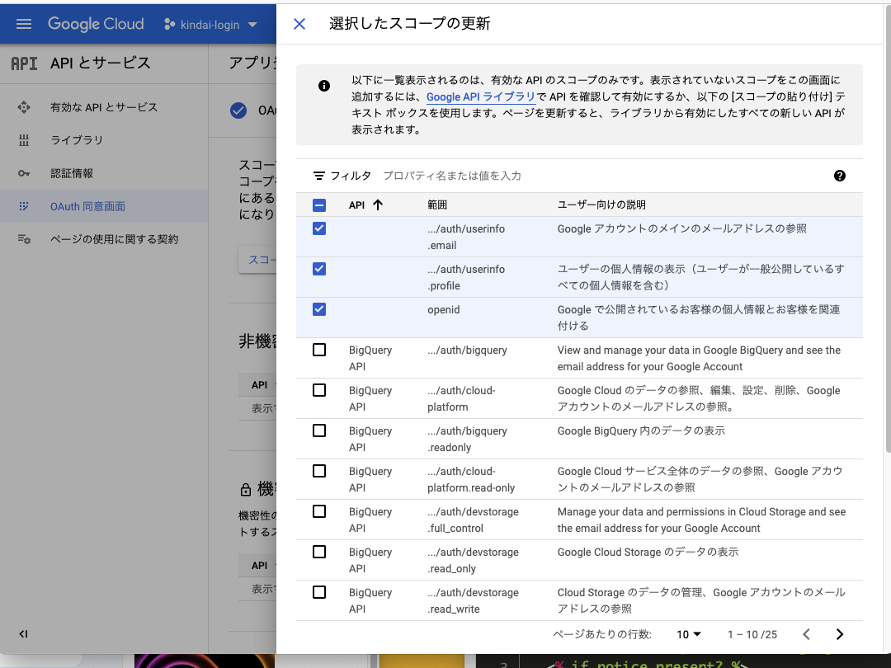
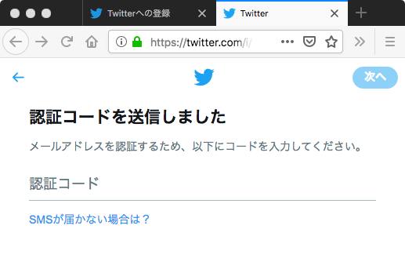
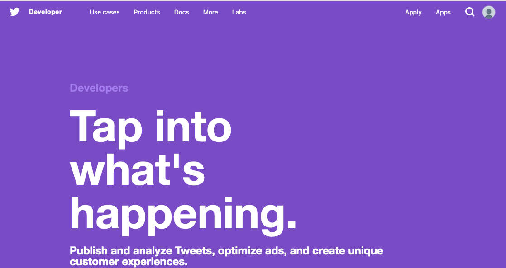

# ネットワークセキュリティ演習
## 12回  web認証と認可の基本

* [レポート](https://forms.gle/c1diVU3jBgsrniYA8)


## 目的

* JWT の利用
* Ruby on Railsの基本的な利用方法
* Twitterアカウント登録
* facebook アカウント登録
* Twitter 開発者登録
* facebook アプリ開発者登録
* Rails で作成したwebアプリから、facebook 認証とtwitter認証、Twitter bot の作成を行う

★次週まで続く


## 必要となるライブラリのインストール

```bash
nano install_rbenv.sh
```

```bash
#!/bin/bash
sudo apt update
sudo apt upgrade -y
sudo apt install -y build-essential 
sudo apt install -y clang
sudo apt install -y cmake
sudo apt install -y direnv
sudo apt install -y git
sudo apt install -y nodejs
sudo apt install -y ruby-dev
sudo apt install -y curl
curl -fsSL https://github.com/rbenv/rbenv-installer/raw/master/bin/rbenv-doctor | bash
curl -sS https://dl.yarnpkg.com/debian/pubkey.gpg | sudo apt-key add -
echo "deb https://dl.yarnpkg.com/debian/ stable main" | sudo tee /etc/apt/sources.list.d/yarn.list
sudo apt update

sudo apt install -y yarn
sudo apt install -y npm
sudo npm install n -g
sudo n stable
sudo apt purge -y nodejs npm
exec $SHELL -l
sudo apt install -y sqlite3 libsqlite3-dev
sudo apt install -y libssl-dev libreadline-dev zlib1g-dev

apt-get install -y libreadline-dev zlib1g-dev
rm -fr ~/.rbenv
git clone https://github.com/rbenv/rbenv.git ~/.rbenv
git clone https://github.com/rbenv/ruby-build.git ~/.rbenv/plugins/ruby-build
echo 'export PATH="$HOME/.rbenv/bin:$PATH"' >> ~/.bashrc
echo 'eval "$(rbenv init -)"' >> ~/.bash_profile
source ~/.bash_profile
source ~/.bashrc
exec $SHELL -l
```

```bash
nano install_ruby.sh
```

```bash
#!/bin/bash
rbenv install 2.5.1
rbenv global 2.5.1
```

```bash
nano install_rails.sh
```

```bash
#!/bin/bash
sudo gem install sqlite3
sudo gem install json-jwt
sudo gem install jwt
sudo gem install rails
sudo gem install twitter
sudo gem install devise
sudo gem install omniauth
sudo gem install omniauth-twitter
sudo gem install omniauth-facebook
```

### 実行

```bash
chmod a+x install_rbenv.sh
chmod a+x install_ruby.sh
chmod a+x install_rails.sh

./install_rbenv.sh
./install_ruby.sh
./install_rails.sh
```

## JWTの利用

トークンの元のJSONデータ

```JSON
claim={
	iss: 'https://twitter.com/',
	sub: '12345',
	aud: 'client.com',
	iat: Time.now,
	exp: 24.hour.from_now
}
```
irbでの利用

```
irb(main):001:0> require 'jwt'
=> true
irb(main):002:0> claim={
irb(main):003:1* iss: 'https://twitter.com/',
irb(main):004:1* sub: '12345',
irb(main):005:1* aud: 'client.com',
irb(main):006:1* iat: Time.now,
irb(main):007:1* exp: 24.hour.from_now}
=> {:iss=>"https://twitter.com/", :sub=>"12345", :aud=>"client.com", :iat=>2018-12-10 08:40:49 +0900, :exp=>2018-12-11 08:40:49 +0900}
irb(main):008:0> jwt=JSON::JWT.new(claim)
=> {"iss"=>"https://twitter.com/", "sub"=>"12345", "aud"=>"client.com", "iat"=>1544398849, "exp"=>1544485249}


```
## Ruby on Railsの基本的な利用方法

### rails プロジェクトの作成

```bash
mkdir rails
cd rails
```

自分で決定したプロジェクト名を使ってRails プロジェクトを作成する

```bash
rails new kindaijoho
cd kindaijoho
rails server -b 0.0.0.0
```

自分のパソコン上のブラウザで http://localhost:3000 にアクセス

### モデルの scaffold 

```
rails generate scaffold idea name:string description:text picture:string

rails db:migrate
rails server
```

### デザインする

app/views/layouts/application.html.erb

```
<%= stylesheet_link_tag    'application', media: 'all', 'data-turbolinks-track': 'reload' %>
```

この1行前に次のタグを追記してください。

```
<link rel="stylesheet" href="//maxcdn.bootstrapcdn.com/bootstrap/3.3.7/css/bootstrap.min.css">
<link rel="stylesheet" href="//maxcdn.bootstrapcdn.com/bootstrap/3.3.7/css/bootstrap-theme.min.css">
```

```
<%= yield %>
```

の部分を以下のように修正

```
<div class="container">
  <%= yield %>
</div>
```

ナビゲーションバーとフッターをレイアウトに追加

```
<nav class="navbar navbar-default navbar-fixed-top" role="navigation">
  <div class="container">
    <div class="navbar-header">
      <button type="button" class="navbar-toggle" data-toggle="collapse" data-target=".navbar-collapse">
        <span class="sr-only">Toggle navigation</span>
        <span class="icon-bar"></span>
        <span class="icon-bar"></span>
        <span class="icon-bar"></span>
      </button>
      <a class="navbar-brand" href="/">The Idea app</a>
    </div>
    <div class="collapse navbar-collapse">
      <ul class="nav navbar-nav">
        <li class="active"><a href="/ideas">Ideas</a></li>
      </ul>
    </div>
  </div>
</nav>
```

### </body>の直前に以下を追加

```
<footer>
  <div class="container">
    Rails Girls 2018
  </div>
</footer>
<script src="https://ajax.googleapis.com/ajax/libs/jquery/3.3.1/jquery.min.js"></script>
<script src="//maxcdn.bootstrapcdn.com/bootstrap/3.3.7/js/bootstrap.min.js"></script>
```

### app/assets/stylesheets/application.css を修正

```
body { padding-top: 100px; }
footer { margin-top: 100px; }
table, td, th { vertical-align: middle; border: none; }
th { border-bottom: 1px solid #DDD; }
```

### 写真アップロード機能を追加する

#### プロジェクトディレクトリ内の Gemfile 

bundler を使って関連ライブラリをインストールする

以下を追加

```
gem 'carrierwave'
```

```bash
bundle
```

### モデルの修正 （ideaがモデル名）

app/models/idea.rb 

```
class Idea < ApplicationRecord
	mount_uploader :picture, PictureUploader
	...
```
### ビューの修正

app/views/ideas/_form.html.erb

```
<%= form.text_field :picture %>
```

これを以下のように修正

```
<%= form.file_field :picture %>
```

### ビューの修正

app/views/ideas/show.html.erb


```
<%= @idea.picture %>
```

を以下のように修正

```
<%= image_tag(@idea.picture_url, width: 600) if @idea.picture.present? %>
```

### routes を修正

config/routes.rb を修正

```
root to: redirect('/ideas')
```

### アプリにページを追加する

```bash
rails generate controller pages info
```

#### 自分のページを編集

app/views/pages/info.html.erb を編集


## Twitterアカウント登録

Twitterアカウントを新規に登録する （持っていない人や別アカウントを使いたい人）

	https://twitter.com/



	


## Twitterのデベロッパーサイトでディベロッパー登録を行う



### Twitterデベロッパーサイトにメールアドレスや電話番号を登録する
### Twitterデベロッパーサイトに各種情報を登録する

企業で使うのではなく、個人的に勉強のために利用するということを登録する


## * facebook アカウント登録

facebook アカウントを新規に登録する （持っていない人）

	https://www.facebook.com
