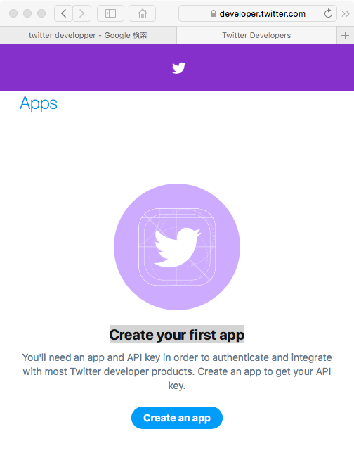

# ネットワークセキュリティ演習
## 13回  web認証と認可の詳細

* [レポート](https://forms.gle/EiLX7LqZJSnhTWub6)


## 目的

## 環境整備

```bash
sudo apt install direnv
sudo apt install npm
sudo npm install -g base64-url-cli
sudo gem install jwt
```

## JWTの解析

### JWTの例

```
eyJraWQiOiIxZTlnZGs3IiwiYWxnIjoiUlMyNTYifQ.ewogImlz
cyI6ICJodHRwOi8vc2VydmVyLmV4YW1wbGUuY29tIiwKICJzdWIiOiAiMjQ4
Mjg5NzYxMDAxIiwKICJhdWQiOiAiczZCaGRSa3F0MyIsCiAibm9uY2UiOiAi
bi0wUzZfV3pBMk1qIiwKICJleHAiOiAxMzExMjgxOTcwLAogImlhdCI6IDEz
MTEyODA5NzAsCiAibmFtZSI6ICJKYW5lIERvZSIsCiAiZ2l2ZW5fbmFtZSI6
ICJKYW5lIiwKICJmYW1pbHlfbmFtZSI6ICJEb2UiLAogImdlbmRlciI6ICJm
ZW1hbGUiLAogImJpcnRoZGF0ZSI6ICIwMDAwLTEwLTMxIiwKICJlbWFpbCI6
ICJqYW5lZG9lQGV4YW1wbGUuY29tIiwKICJwaWN0dXJlIjogImh0dHA6Ly9l
eGFtcGxlLmNvbS9qYW5lZG9lL21lLmpwZyIKfQ.rHQjEmBqn9Jre0OLykYNn
spA10Qql2rvx4FsD00jwlB0Sym4NzpgvPKsDjn_wMkHxcp6CilPcoKrWHcip
R2iAjzLvDNAReF97zoJqq880ZD1bwY82JDauCXELVR9O6_B0w3K-E7yM2mac
AAgNCUwtik6SjoSUZRcf-O5lygIyLENx882p6MtmwaL1hd6qn5RZOQ0TLrOY
u0532g9Exxcm-ChymrB4xLykpDj3lUivJt63eEGGN6DH5K6o33TcxkIjNrCD
4XB1CKKumZvCedgHHF3IAK4dVEDSUoGlH9z4pP_eWYNXvqQOjGs-rDaQzUHl
6cQQWNiDpWOl_lxXjQEvQ
```

### JWT の構造

	ヘッダー.ペイロード.署名

```
# ヘッダー
eyJraWQiOiIxZTlnZGs3IiwiYWxnIjoiUlMyNTYifQ

# ペイロード
ewogImlz
cyI6ICJodHRwOi8vc2VydmVyLmV4YW1wbGUuY29tIiwKICJzdWIiOiAiMjQ4Mjg5NzYxMDAxIiwKICJhdWQiOiAiczZCaGRSa3F0MyIsCiAibm9uY2UiOiAibi0wUzZfV3pBMk1qIiwKICJleHAiOiAxMzExMjgxOTcwLAogImlhdCI6IDEzMTEyODA5NzAsCiAibmFtZSI6ICJKYW5lIERvZSIsCiAiZ2l2ZW5fbmFtZSI6ICJKYW5lIiwKICJmYW1pbHlfbmFtZSI6ICJEb2UiLAogImdlbmRlciI6ICJmZW1hbGUiLAogImJpcnRoZGF0ZSI6ICIwMDAwLTEwLTMxIiwKICJlbWFpbCI6ICJqYW5lZG9lQGV4YW1wbGUuY29tIiwKICJwaWN0dXJlIjogImh0dHA6Ly9leGFtcGxlLmNvbS9qYW5lZG9lL21lLmpwZyIKfQ

# 署名
rHQjEmBqn9Jre0OLykYNnspA10Qql2rvx4FsD00jwlB0Sym4NzpgvPKsDjn_wMkHxcp6CilPcoKrWHcipR2iAjzLvDNAReF97zoJqq880ZD1bwY82JDauCXELVR9O6_B0w3K-E7yM2macAAgNCUwtik6SjoSUZRcf-O5lygIyLENx882p6MtmwaL1hd6qn5RZOQ0TLrOYu0532g9Exxcm-ChymrB4xLykpDj3lUivJt63eEGGN6DH5K6o33TcxkIjNrCD4XB1CKKumZvCedgHHF3IAK4dVEDSUoGlH9z4pP_eWYNXvqQOjGs-rDaQzUHl6cQQWNiDpWOl_lxXjQEvQ


```
### JWSヘッダーのデコード

```
base64url decode eyJraWQiOiIxZTlnZGs3IiwiYWxnIjoiUlMyNTYifQ

{"kid":"1e9gdk7","alg":"RS256"}
```

### JWS ペイロードのデコード

``` 
base64url decode ewogImlzcyI6ICJodHRwOi8vc2VydmVyLmV4YW1wbGUuY29tIiwKICJzdWIiOiAiMjQ4Mjg5NzYxMDAxIiwKICJhdWQiOiAiczZCaGRSa3F0MyIsCiAibm9uY2UiOiAibi0wUzZfV3pBMk1qIiwKICJleHAiOiAxMzExMjgxOTcwLAogImlhdCI6IDEzMTEyODA5NzAsCiAibmFtZSI6ICJKYW5lIERvZSIsCiAiZ2l2ZW5fbmFtZSI6ICJKYW5lIiwKICJmYW1pbHlfbmFtZSI6ICJEb2UiLAogImdlbmRlciI6ICJmZW1hbGUiLAogImJpcnRoZGF0ZSI6ICIwMDAwLTEwLTMxIiwKICJlbWFpbCI6ICJqYW5lZG9lQGV4YW1wbGUuY29tIiwKICJwaWN0dXJlIjogImh0dHA6Ly9leGFtcGxlLmNvbS9qYW5lZG9lL21lLmpwZyIKfQ

{
 "iss": "http://server.example.com",
 "sub": "248289761001",
 "aud": "s6BhdRkqt3",
 "nonce": "n-0S6_WzA2Mj",
 "exp": 1311281970,
 "iat": 1311280970,
 "name": "Jane Doe",
 "given_name": "Jane",
 "family_name": "Doe",
 "gender": "female",
 "birthdate": "0000-10-31",
 "email": "janedoe@example.com",
 "picture": "http://example.com/janedoe/me.jpg"
```

### JWS 署名のデコード

デコード結果は、バイナリなので、10 進数表記に変換する
```
base64url decode rHQjEmBqn9Jre0OLykYNnspA10Qql2rvx4FsD00jwlB0Sym4NzpgvPKsDjn_wMkHxcp6CilPcoKrWHcipR2iAjzLvDNAReF97zoJqq880ZD1bwY82JDauCXELVR9O6_B0w3K-E7yM2macAAgNCUwtik6SjoSUZRcf-O5lygIyLENx882p6MtmwaL1hd6qn5RZOQ0TLrOYu0532g9Exxcm-ChymrB4xLykpDj3lUivJt63eEGGN6DH5K6o33TcxkIjNrCD4XB1CKKumZvCedgHHF3IAK4dVEDSUoGlH9z4pP_eWYNXvqQOjGs-rDaQzUHl6cQQWNiDpWOl_lxXjQEvQ | od -tu1 -An

 239 191 189 116  35  18  96 106 239 191 189 239 191 189 107 123
  67 239 191 189 239 191 189  70  13 239 191 189 239 191 189  64
 239 191 189  68  42 239 191 189 106 239 191 189 199 129 108  15
  77  35 239 191 189  80 116  75  41 239 191 189  55  58  96 239
 191 189 239 191 189  14  57 239 191 189 239 191 189 239 191 189
   7 239 191 189 239 191 189 122  10  41  79 114 239 191 189 239
 191 189  88 119  34 239 191 189  29 239 191 189   2  60 203 188
  51  64  69 239 191 189 125 239 191 189  58   9 239 191 189 239
 191 189  60 209 144 239 191 189 111   6  60 216 144 218 184  37
 239 191 189  45  84 125  59 239 191 189 239 191 189 239 191 189
  13 239 191 189 239 191 189  78 239 191 189  51 105 239 191 189
 112   0  32  52  37  48 239 191 189  41  58  74  58  18  81 239
 191 189  92 127 227 185 151  40   8 200 177  13 239 191 189 239
 191 189  54 239 191 189 239 191 189  45 239 191 189   6 239 191
 189 239 191 189  23 122 239 191 189 126  81 100 239 191 189  52
  76 239 191 189 239 191 189  98 239 191 189  57 239 191 189 104
  61  19  28  92 239 191 189 239 191 189 239 191 189 106 239 191
 189 239 191 189  18 239 191 189 239 191 189 239 191 189  85  34
 239 191 189 239 191 189 122 239 191 189 239 191 189   6  24 222
 131  31 239 191 189 239 191 189 239 191 189 125 239 191 189 115
  25   8 239 191 189 239 191 189 239 191 189  15 239 191 189 239
 191 189 239 191 189  34 239 191 189 239 191 189 102 111   9 239
 191 189  96  28 113 119  32   2 239 191 189 117  81   3  73  74
   6 239 191 189 127 115 239 191 189 239 191 189 121 102  13  94
 239 191 189 239 191 189  58  49 239 191 189 239 191 189 239 191
 189 239 191 189  67  53   7 239 191 189 239 191 189  16  65  99
  98  14 239 191 189 239 191 189 239 191 189 239 191 189 113  94
  52   4 239 191 189
```

### Ruby の場合

```
irb
```

```ruby
require 'openssl'
require 'jwt'
require 'json'
 
# 秘密鍵生成
rsa_private = OpenSSL::PKey::RSA.generate(2048)

# 公開鍵生成
rsa_public = rsa_private.public_key

# sample data
payload = {
  id: 1,
  name: 'tanaka',
  password: 'jau0328ura0jrdsf3'
}

# payload を暗号化 (秘密鍵でしかできない)
token = JWT.encode(payload, rsa_private, 'RS256')

# payload を復号化 (公開鍵でもできる)
JWT.decode(token, rsa_public, true, { algorithm: 'RS256' })

# 秘密鍵で復号化
JWT.decode(token, rsa_private, true, { algorithm: 'RS256' })
```

## http リダイレクトの確認

### htmlファイルのヘッダを修正してみる

	sudo nano /var/www/html/index.html

head タグの部分を修正

```html
<meta http-equiv="content-type" charset="utf-8">
<html>
 <head>

</head>
...
```

ページを開いて、５秒後に近畿大学のページに移動する

```html
<meta http-equiv="content-type" charset="utf-8">
<head> 
  <meta http-equiv="refresh" content="5; URL=http://www.kindai.ac.jp/" />
</head>
...
```

### ブラウザで実際にwebページにアクセスしてみる

	 http://自分のマシンのIPアドレス
	 
５秒まって、近畿大学のページに遷移されるのを確認する

	
## Twitter開発者サイト

	https://developer.twitter.com
	

### ログインする

	https://developer.twitter.com

### APIのドキュメントの確認

	https://developer.twitter.com/en/docs/api-reference-index

### Create your first appページに行く

	https://developer.twitter.com/en/apps
	


### Create an app ボタンをクリック

#### App details

1. App name （アプリ名）

	例： yamasaki bot
2. Application description（アプリの説明）
	
	例：Twitter bot for learning Web authentication and authorization.
3. Website URL（自分のTwitterのページのURL）
	
	例： https://twitter.com/shigeichiro1
	
4.  Callbask URLs（RPのコールバックURL)
	OAuthを使った認可をうけるRPを作る場合はここにコールバックURLを設定する
	例： 空白
	
5. 	Organization name（組織名）

	Kindai University
	
6.  Organization website URL（組織のURL)

	例： http://www.kindai.ac.jp
	
7.  Tell us how this app will be used (どのように利用されるか)
	
	例： 
This application is used to learn OAuth and OpenID connect.I will experiment about various cases of Twitter API.		
	


#### 認証、認可トークンの入手

Keys and tokens から

1. 認証トークン （Consumer API keys ） 
	* Twitter APIから見たこのボットのクライアントID
	* 例： ymnrj6jA4c8HHPqtOXEofSNu4

	* Twitter APIから見たこのボットの secret (パスフレーズ）
	* 例：
	jlqHFy5x3lSwbpiZ9fxVCZevP2RBxcOTlr2riLxqdpxgU5mu2R

2. アクセストークン 

	create ボタンをクリックして生成する
	
	* Twitter APIへのアクセストークン
	* 例：1072009958848290816-i6tVvAjNeKc640Zi76ZNrvLHMHxDHQ
	
	 * Twitter APIへのアクセストークンの secret (パスフレーズ）
	 * 例：Zd5u9T09D9yH2FcfKamhdbo3cjxGPRyzKWt1OFPFVBKhH


### Ruby でツイートするプログラム

	irb
	
```ruby
require 'twitter'

# 取得したキーを代入する

client = Twitter::REST::Client.new do |config|
  config.consumer_key        = "<コンシューマAPI key>"
  config.consumer_secret     = "<コンシューマAPI secret key>"
  config.access_token        = "<アクセストークン>"
  config.access_token_secret = "<アクセストークンsecret>"
end

# 実際につぶやいてみる

client.update("こんにちは世界さん")
```


### タイムラインを取得するプログラム

```ruby
# 自分のタイムラインを取得（最近の20件の配列）

tl = client.home_timeline

# テキストの内容

tl[0].text
=> "今日は雨です"

# ユーザ名
tl[0].user.name
=> "shigeichiro"
```

## 自作のWebアプリでTwitterを OP(IdP)としてログインする

### 手順

1. Twitter Developer登録
2. credentials.yml.encにConsumer API keysを設定
3. gem追加
4. deviseの設定
5. userモデルの設定
6. callbackの設定
7. viewの設定
8. route設定

### Twitter APIの設定の修正

コールバックURLなどを登録する

	https://developer.twitter.com/en/apps
	


#### details → edit で編集モードにする

#### Twitter でログインできるようにする

Allow this application to be used to sign in with TwitterLearn more

 □Enable Sign in with Twitter
 
 ↑ このチェックボックスにチェックをつける
 
 
#### Callback URLs (required)

自分のローカルな環境で実行する場合は、http://127.0.0.1:3000 でよい

ちゃんとグローバルなドメイン名を持っている場合は、それを指定します

	http://127.0.0.1:3000/auth/twitter/callback
	

#### Twitter の設定変更を save


### Railsプロジェクトの作成

```bash
cd ~
cd rails
rails new twitterRP
cd twitterRP
```

#### Rails rootの確認

rails コマンドは、必ずこのディレクトリからうちます

```bash
pwd
```
### Gemfileの修正

	nano Gemfile
	

```ruby


# 以下の2行を追加
gem 'devise'
gem 'omniauth'
gem 'omniauth-twitter'

```

```bash
bundle install
```

### deviseのインストール

```
rails g devise:install
```

### userモデルの作成

```bash
rails g devise user
```


```
nano config/initializers/devise.rb
```

```
# ==> OmniAuth
# Add a new OmniAuth provider. Check the wiki for more information on setting
# up on your models and hooks.
# config.omniauth :github, 'APP_ID', 'APP_SECRET', scope: 'user,public_repo'
#250行目あたりに以下の内容を記述
config.omniauth :twitter, ENV['TWITTER_CONSUMER_KEY'], ENV['TWITTER_CONSUMER_SECRET'], display: 'popup'
```

先程記述した［TWITTER_CONSUMER_KEY］と［TWITTER_CONSUMER_SECRET］に環境変数を設定します。
［TWITTER_CONSUMER_KEY］にTwitter APPの「Keys and Access Tokens」ページの「Consumer Key (API Key)」。
［TWITTER_CONSUMER_SECRET］には「Consumer Secret (API Secret)」を記述します。

### 環境変数の設定

```bash
export TWITTER_CONSUMER_KEY="123456789012345"
export TWITTER_CONSUMER_SECRET="1234567890abcdefghijklmnopqrstuvwxyz"
```

### deviseメソッドを追加

app/models/user.rbにomniauthableを追加

	nano app/models/user.rb

```ruby
class User < ApplicationRecord
  # Include default devise modules. Others available are:
  # :confirmable, :lockable, :timeoutable and :omniauthable
  devise :database_authenticatable, :registerable,
  :recoverable, :rememberable, :trackable, :validatable, :omniauthable
・
・
・
```

### userモデル編集

userモデルの編集して、app/models/user.rbを下記を追加

	nano app/models/user.rb
	
```ruby
class User < ApplicationRecord
・
・
・
  def self.find_for_oauth(auth)
    user = User.where(uid: auth.uid, provider: auth.provider).first
 
    unless user
      user = User.create(
        uid:      auth.uid,
        provider: auth.provider,
        email:    User.dummy_email(auth),
        password: Devise.friendly_token[0, 20],
        image: auth.info.image,
        name: auth.info.name,
        nickname: auth.info.nickname,
        location: auth.info.location
        )
    end
 
    user
  end
 
  private
 
  def self.dummy_email(auth)
    "#{auth.uid}-#{auth.provider}@example.com"
  end
end
```

### マイグレーション

```bash
rails db:migrate
```

### コールバック設定

app/controllers/usersという階層にomniauth_callbacks_controller.rbを作成して以下を記述します。

	
	nano app/controllers/users/omniauth_callbacks_controller.rb

```ruby
class Users::OmniauthCallbacksController < Devise::OmniauthCallbacksController
  def twitter
    callback_from :twitter
  end
 
  private
  def callback_from(provider)
    provider = provider.to_s
 
    @user = User.find_for_oauth(request.env['omniauth.auth'])
 
    if @user.persisted?
      flash[:notice] = I18n.t('devise.omniauth_callbacks.success', kind: provider.capitalize)
      sign_in_and_redirect @user, event: :authentication
    else
      session["devise.#{provider}_data"] = request.env['omniauth.auth']
      redirect_to new_user_registration_url
    end
  end
end
```

### controllerを作成

	rails g controller home index

生成されたapp/home/index.html.erbを下記のように編集

	nano app/home/index.html.erb
	
```html
<ul>
<%if user_signed_in? %>
<li><%=current_user.email%></li>
<li><%=current_user.name%></li>
<li><%=current_user.nickname%></li>
<li><%=current_user.image%></li>
<li><%=current_user.location%></li>
<li><%= link_to "ログアウト", destroy_user_session_path, method: :delete %></li>
  <%else%>
        <li><%= link_to "ログイン", new_user_session_path %></li>
  <%end%>
</ul>
```

### routeを設定

作成したコントローラーのrouteを設定。
config/routes.rbに以下の記述を追加します。

	nano config/routes.rb
	
```ruby
Rails.application.routes.draw do
root "home#index"
get "home/index"
end
 
devise_for :users, controllers: {
  omniauth_callbacks: 'users/omniauth_callbacks'
}
```

### db マイグレーション

	rake db:migrate
	
### サーバ起動

	rails s -b 0.0.0.0
	


--
##  別の方法

### omniauth.rb ファイルの作成

	nano config/initializers/omniauth.rb
	
#### <コンシューマAPI key>と<コンシューマAPI secret key>の設定

```ruby
Rails.application.config.middleware.use OmniAuth::Builder do
  provider :twitter, <コンシューマAPI key>, <コンシューマAPI secret key>
end
```

例

```ruby
Rails.application.config.middleware.use OmniAuth::Builder do
  provider :twitter, "ymnrj6jA4c8HHPqtOXEofSNu4","jlqHFy5x3lSwbpiZ9fxVCZevP2RBxcOTlr2riLxqdpxgU5mu2R"

end

```
### Userモデルを作成

```
rails g model user provider:string uid:string user_name:string image_url:string
```

### User モデルの修正

	nano app/models/user.rb

```ruby
class User < ApplicationRecord
  def self.find_or_create_from_auth(auth)
    provider = auth[:provider]
    uid = auth[:uid]
    user_name = auth[:info][:user_name]
    image_url = auth[:info][:image]

    self.find_or_create_by(provider: provider, uid: uid) do |user|
      user.user_name = user_name
      user.image_url = image_url
    end
  end
end
```

### セッションコントローラの生成

	rails g controller sessions
	

### sessions コントローラの修正

	nano app/controllers/sessions_controller.rb

```ruby
class SessionsController < ApplicationController
  def create
    user = User.find_or_create_from_auth(request.env['omniauth.auth'])
    session[:user_id] = user.id
    flash[:notice] = "ユーザー認証が完了しました。"
    redirect_to root_path
  end

  def destroy
    reset_session
    flash[:notice] = "ログアウトしました。"
    redirect_to root_path
  end
end
```

### ユーザのログイン状態管理のためのヘルパーメソッドを追加

	nano app/controllers/application_controller.rb

```ruby
class ApplicationController < ActionController::Base
  protect_from_forgery with: :exception
  helper_method :current_user, :logged_in?

  private

  def current_user
    return unless session[:user_id]
    @current_user ||= User.find(session[:user_id])
  end

  def logged_in?
    !!session[:user_id]
  end

  def authenticate
    return if logged_in?
    redirect_to root_path, alert: "ログインしてください"
  end
end
```

### ルーティングの設定

	nano config/routes.rb
	
```ruby
Rails.application.routes.draw do
  # For details on the DSL available within this file, see http://guides.rubyon$
  get '/auth/:provider/callback', to: 'sessions#create'
  get '/logout', to: 'sessions#destroy'

  root 'home#top'
end
```

### ビューの修正

	nano app/views/layouts/application.html.erb
	

```html
<!DOCTYPE html>
<html>
  <head>
    <title>TwitterRP</title>
    <%= csrf_meta_tags %>
    <%= csp_meta_tag %>

    <%= stylesheet_link_tag    'application', media: 'all', 'data-turbolinks-tr$
    <%= javascript_include_tag 'application', 'data-turbolinks-track': 'reload'$
  </head>

  <body>
    <% if flash[:notice] %>
      <div class="notice">
      <%= flash[:notice]%>
      </div>
    <% end %>
    <%= yield %>
  </body>
</html>

```

### DBのマイグレーション

	rake db:migrate
	
