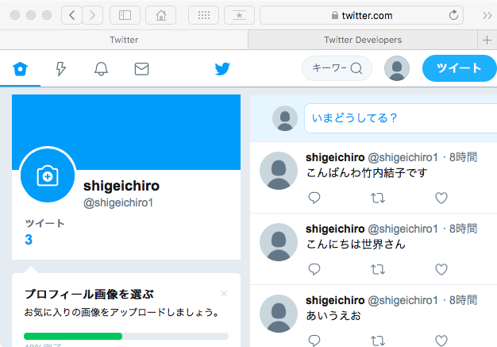
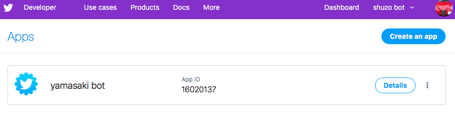

# ネットワークセキュリティ演習
## 13回  web認証と認可の詳細

## Google Cloud Platform への利用者登録

[https://console.cloud.google.com/home/dashboard?project=internet-engineering&hl=ja](https://console.cloud.google.com/home/dashboard?project=internet-engineering&hl=ja)

* ユーザ登録をする


## login

山崎家： 

```bash
ssh <ユーザID>@106.157.214.199
```

## webサーバにログイン

```bash
ssh <ユーザID>@192.168.0.250
```

## http リダイレクトの確認

### ドキュメントルートへの移動

	sudo nano /var/www/html/<ユーザID>/index.html

head タグの部分を修正

```html
<meta http-equiv="content-type" charset="utf-8">
<html>
 <head>

</head>
...
```

URL
http://106.157.214.199/<ユーザID>/

ページを開いて、５秒後に近畿大学のページに移動する


```html
<meta http-equiv="content-type" charset="utf-8">
<head> 
  <meta http-equiv="refresh" content="5; URL=http://www.kindai.ac.jp/" />
</head>
...
```

# Railsの利用

## 自分のwebサーバのポート番号

ユーザIDから計算してください

3000 + （ユーザIDの２桁目× 100) + ユーザIDの数字部分の下二桁

例
ユーザID：160076b　 →　3676
ユーザID：190009p 　→　3909

## サーバへのアクセスURL

http://106.157.214.199:<ポート番号>/

例
ユーザID：160076b　 →　3676

http://106.157.214.199:3676/


## Ruby on Railsの基本的な利用方法

### rails プロジェクトの作成

```bash
mkdir rails
cd rails
```

自分で決定したプロジェクト名を使ってRails プロジェクトを作成する
（パスワードの入力などが必要）

```bash
rails new kindaijoho

cd kindaijoho
bundle install
rails webpacker:install 

rails generate scaffold idea name:string description:text picture:string

rails db:migrate
rails server -b 0.0.0.0 -p <ポート番号>
```

ブラウザで http://106.157.214.199:<ポート番号>/ にアクセスして確認

#### サーバ停止

コントロール C


### 参考ページ

#### [Rails+omniauth-google-oauth2でGoogleログイン(devise無し)](https://zenn.dev/batacon/articles/e9b4a88ede2889)

### Google Photos API

[https://console.cloud.google.com/apis/library/photoslibrary.googleapis.com?hl=ja&project=fuk.kindai.ac.jp:api-project-658275677508&supportedpurview=project](https://console.cloud.google.com/apis/library/photoslibrary.googleapis.com?hl=ja&project=fuk.kindai.ac.jp:api-project-658275677508&supportedpurview=project)

有効にする

### API とサービスの「認証情報」を選択

* 「同意画面を構成」をクリック
* User Type 「外部」を選択
* 「作成」

### アプリ情報

* アプリ名: memories

#### アプリのドメイン

* アプリケーションのホームページ: http://106.157.214.199/<ユーザID>/

#### スコープ

* ウェブアプリケーション

### 認証情報

+ 認証情報を作成

OAuth クライアントを作成しました

### クライアントIDとクライアントシークレットをコピーする

```
クライアントID
658275677508-97kakkcsp02hf995o6k34j7209b2orrn.apps.googleusercontent.com
クライアントシークレット
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
```


## OAuth2.0の実験

* [OAuth 2.0 Playground ](https://www.oauth.com/playground/)


1. Client Registration （クライアント登録）: 自動的にクライアントが作成されて登録されますTo begin, register a client and a user (don't worry, we'll make it quick)をクリック
2. Register ボタンで登録（クライアントとユーザアカウントが作成されます），情報を確認（メモする）
3. Continue 
4. OAuth 2.0 Authorization Code Flow 
5. 認証URLを作成

 ```
 https://authorization-server.com/authorize?
  response_type=code
  &client_id=aqJGFY495p0Rn6hDhAJHLxKa
  &redirect_uri=https://www.oauth.com/playground/authorization-code.html
  &scope=photo+offline_access
  &state=vGontmgmuCXRHnDF
  ```

2. Approve（承認）
3. 1. 


### デザインする

app/views/layouts/application.html.erb

```
<%= stylesheet_link_tag    'application', media: 'all', 'data-turbolinks-track': 'reload' %>
```

この1行前に次のタグを追記してください。

```
<link rel="stylesheet" href="//maxcdn.bootstrapcdn.com/bootstrap/3.3.7/css/bootstrap.min.css">
<link rel="stylesheet" href="//maxcdn.bootstrapcdn.com/bootstrap/3.3.7/css/bootstrap-theme.min.css">
```

```
<%= yield %>
```

の部分を以下のように修正

```
<div class="container">
  <%= yield %>
</div>
```

ナビゲーションバーとフッターをレイアウトに追加

```
<nav class="navbar navbar-default navbar-fixed-top" role="navigation">
  <div class="container">
    <div class="navbar-header">
      <button type="button" class="navbar-toggle" data-toggle="collapse" data-target=".navbar-collapse">
        <span class="sr-only">Toggle navigation</span>
        <span class="icon-bar"></span>
        <span class="icon-bar"></span>
        <span class="icon-bar"></span>
      </button>
      <a class="navbar-brand" href="/">The Idea app</a>
    </div>
    <div class="collapse navbar-collapse">
      <ul class="nav navbar-nav">
        <li class="active"><a href="/ideas">Ideas</a></li>
      </ul>
    </div>
  </div>
</nav>
```

### </body>の直前に以下を追加

```
<footer>
  <div class="container">
    Rails Girls 2018
  </div>
</footer>
<script src="https://ajax.googleapis.com/ajax/libs/jquery/3.3.1/jquery.min.js"></script>
<script src="//maxcdn.bootstrapcdn.com/bootstrap/3.3.7/js/bootstrap.min.js"></script>
```

### app/assets/stylesheets/application.css を修正

```
body { padding-top: 100px; }
footer { margin-top: 100px; }
table, td, th { vertical-align: middle; border: none; }
th { border-bottom: 1px solid #DDD; }
```

### Railsで写真アップロード機能を追加してみる


#### プロジェクトディレクトリ内の Gemfile 

bundler を使って関連ライブラリをインストールする

以下を追加

```
gem 'carrierwave'
```

```bash
bundle
```

### モデルの修正 （ideaがモデル名）

app/models/idea.rb 

```
class Idea < ApplicationRecord
	mount_uploader :picture, PictureUploader
	...
```
### ビューの修正

app/views/ideas/_form.html.erb

```
<%= form.text_field :picture %>
```

これを以下のように修正

```
<%= form.file_field :picture %>
```

### ビューの修正

app/views/ideas/show.html.erb


```
<%= @idea.picture %>
```

を以下のように修正

```
<%= image_tag(@idea.picture_url, width: 600) if @idea.picture.present? %>
```

### routes を修正

config/routes.rb を修正

```
root to: redirect('/ideas')
```

### アプリにページを追加する

```bash
rails generate controller pages info
```

#### 自分のページを編集

app/views/pages/info.html.erb を編集


### ブラウザで実際にwebページにアクセスしてみる

	 http://自分のマシンのIPアドレス
	 
５秒まって、近畿大学のページに遷移されるのを確認する

	
## Twitter開発者サイト

	https://developer.twitter.com
	

### ログインする

	https://developer.twitter.com

### APIのドキュメントの確認

	https://developer.twitter.com/en/docs/api-reference-index

### Create your first appページに行く

	https://developer.twitter.com/en/apps
	

### Create an app ボタンをクリック

#### App details

1. App name （アプリ名）

	例： yamasaki bot
2. Application description（アプリの説明）
	
	例：Twitter bot for learning Web authentication and authorization.
3. Website URL（自分のTwitterのページのURL）
	
	例： https://twitter.com/shigeichiro1
	
4.  Callbask URLs（RPのコールバックURL)
	OAuthを使った認可をうけるRPを作る場合はここにコールバックURLを設定する
	例： 空白
	
5. 	Organization name（組織名）

	Kindai University
	
6.  Organization website URL（組織のURL)

	例： http://www.kindai.ac.jp
	
7.  Tell us how this app will be used (どのように利用されるか)
	
	例： 
This application is used to learn OAuth and OpenID connect.I will experiment about various cases of Twitter API.		
	


#### 認証、認可トークンの入手

Keys and tokens から

1. 認証トークン （Consumer API keys ） 
	* Twitter APIから見たこのボットのクライアントID
	* 例： ymnrj6jA4c8HHPqtOXEofSNu4

	* Twitter APIから見たこのボットの secret (パスフレーズ）
	* 例：
	jlqHFy5x3lSwbpiZ9fxVCZevP2RBxcOTlr2riLxqdpxgU5mu2R

2. アクセストークン 

	create ボタンをクリックして生成する
	
	* Twitter APIへのアクセストークン
	* 例：1072009958848290816-i6tVvAjNeKc640Zi76ZNrvLHMHxDHQ
	
	 * Twitter APIへのアクセストークンの secret (パスフレーズ）
	 * 例：Zd5u9T09D9yH2FcfKamhdbo3cjxGPRyzKWt1OFPFVBKhH


### Ruby でツイートするプログラム

	irb
	
```ruby
require 'twitter'

# 取得したキーを代入する

client = Twitter::REST::Client.new do |config|
  config.consumer_key        = "<コンシューマAPI key>"
  config.consumer_secret     = "<コンシューマAPI secret key>"
  config.access_token        = "<アクセストークン>"
  config.access_token_secret = "<アクセストークンsecret>"
end

# 実際につぶやいてみる

client.update("こんにちは世界さん")
```



### タイムラインを取得するプログラム

```ruby
# 自分のタイムラインを取得（最近の20件の配列）

tl = client.home_timeline

# テキストの内容

tl[0].text
=> "今日は雨です"

# ユーザ名
tl[0].user.name
=> "shigeichiro"
```

## 自作のWebアプリでTwitterを OP(IdP)としてログインする

### 手順

1. Twitter Developer登録
2. credentials.yml.encにConsumer API keysを設定
3. gem追加
4. deviseの設定
5. userモデルの設定
6. callbackの設定
7. viewの設定
8. route設定

### Twitter APIの設定の修正

コールバックURLなどを登録する


	https://developer.twitter.com/en/apps
	


#### details → edit で編集モードにする

#### Twitter でログインできるようにする

Allow this application to be used to sign in with TwitterLearn more

 □Enable Sign in with Twitter
 
 ↑ このチェックボックスにチェックをつける
 
 
#### Callback URLs (required)

自分のローカルな環境で実行する場合は、プライベートアドレスでよい

ちゃんとグローバルなドメイン名を持っている場合は、それを指定します

	
Rails ＋devise の利用を想定して、CallbackURLは以下の2つを設定する

http://localhost:3000/users/auth/twitter/callback

http://localhost:3000/users/auth/twitter

＋


http://localhost:3000/users/omniauth_callbacks


#### Twitter の設定変更を save


### Railsプロジェクトの作成

```bash
cd ~
cd rails
rails new twitterRP
cd twitterRP
```

#### Rails rootの確認

rails コマンドは、必ずこのディレクトリからうちます

```bash
pwd
```
### Gemfileの修正

	nano Gemfile
	

```ruby
# 以下の2行を追加
gem 'devise'
gem 'omniauth'
gem 'omniauth-twitter'

```

```bash
bundle install
```

### deviseのインストール

```
rails g devise:install
```

### userモデルの作成

```bash
rails g devise user
```

### userモデルの修正

```bash
rails g migration AddColumnsToUsers provider:string uid:string username:string
```

### Userコントローラにコールバック処理を実装する

```
rails g controller omniauth_callbacks
```


### db マイグレーション

	rake db:migrate
	
	
### /deviseの設定

```
nano config/initializers/devise.rb
```

```
  # ==> OmniAuth
  # Add a new OmniAuth provider. Check the wiki for more information on setting
  # up on your models and hooks.
  # config.omniauth :github, 'APP_ID', 'APP_SECRET', scope: 'user,public_repo'

  # config.omniauth :twitter, "twiiter api key", "twitter secret key"
    config.omniauth :twitter, "otcQRTtpNyBsAWGtImhNgtoaE", "7a9UBpvmHj7zkdkS1MEkB8N0nsVD0PHpEKOp9SHtY\
VowKnYSAm"


```


### 環境変数の設定

［TWITTER_CONSUMER_KEY］にTwitter APPの「Keys and Access Tokens」ページの「Consumer Key (API Key)」。
［TWITTER_CONSUMER_SECRET］には「Consumer Secret (API Secret)」を記述します。


```bash
export TWITTER_CONSUMER_KEY="123456789012345"
export TWITTER_CONSUMER_SECRET="1234567890abcdefghijklmnopqrstuvwxyz"
```

### deviseメソッドを追加

app/models/user.rb   にomniauthable を追加

	nano app/models/user.rb

```ruby
class User < ApplicationRecord
  # Include default devise modules. Others available are:
  # :confirmable, :lockable, :timeoutable and :omniauthable
  devise :database_authenticatable, :registerable,
  :recoverable, :rememberable, :trackable, :validatable, :omniauthable
・
・
・
```


### omniauth_callbacks_controller.rb を編集

app/controllers/omniauth_callbacks_controller.rb

★　スーパークラスのクラス名の違いに注意！！！

```ruby

class OmniauthCallbacksController < Devise::OmniauthCallbacksController
  def twitter
      callback_from :twitter
    end

    private

    def callback_from(provider)
      provider = provider.to_s

      @user = User.find_for_oauth(request.env['omniauth.auth'])

      if @user.persisted?
        flash[:notice] = I18n.t('devise.omniauth_callbacks.success', kind: provider.capitalize)
        sign_in_and_redirect @user, event: :authentication
      else
        session["devise.#{provider}_data"] = request.env['omniauth.auth']
        redirect_to new_user_registration_url
      end
    end
end
```


### ルーティングの編集

nano config/routes.rb

```ruby
Rails.application.routes.draw do
  get 'welcome/index'
  devise_for :users, controllers: { omniauth_callbacks: 'omniauth_callbacks' } # ここを変更
  # For details on the DSL available within this file, see http://guides.rubyonrails.org/routing.html

  root 'welcome#index'
end
```

### ルーティングの確認

```bash
$ rails routes
                         Prefix Verb     URI Pattern                                                                              Controller#Action
                  welcome_index GET      /welcome/index(.:format)                                                                 welcome#index
               new_user_session GET      /users/sign_in(.:format)                                                                 devise/sessions#new
                   user_session POST     /users/sign_in(.:format)                                                                 devise/sessions#create
           destroy_user_session DELETE   /users/sign_out(.:format)                                                                devise/sessions#destroy
user_twitter_omniauth_authorize GET|POST /users/auth/twitter(.:format)                                                            omniauth_callbacks#passthru
 user_twitter_omniauth_callback GET|POST /users/auth/twitter/callback(.:format)                                                   omniauth_callbacks#twitter
              new_user_password GET      /users/password/new(.:format)                                                            devise/passwords#new
             edit_user_password GET      /users/password/edit(.:format)                                                           devise/passwords#edit
                  user_password PATCH    /users/password(.:format)                                                                devise/passwords#update
                                PUT      /users/password(.:format)                                                                devise/passwords#update
                                POST     /users/password(.:format)                                                                devise/passwords#create
       cancel_user_registration GET      /users/cancel(.:format)                                                                  devise/registrations#cancel
          new_user_registration GET      /users/sign_up(.:format)                                                                 devise/registrations#new
         edit_user_registration GET      /users/edit(.:format)                                                                    devise/registrations#edit
              user_registration PATCH    /users(.:format)                                                                         devise/registrations#update
                                PUT      /users(.:format)                                                                         devise/registrations#update
                                DELETE   /users(.:format)                                                                         devise/registrations#destroy
                                POST     /users(.:format)                                                                         devise/registrations#create
                           root GET      /                                                                                        welcome#index
             rails_service_blob GET      /rails/active_storage/blobs/:signed_id/*filename(.:format)                               active_storage/blobs#show
      rails_blob_representation GET      /rails/active_storage/representations/:signed_blob_id/:variation_key/*filename(.:format) active_storage/representations#show
             rails_disk_service GET      /rails/active_storage/disk/:encoded_key/*filename(.:format)                              active_storage/disk#show
      update_rails_disk_service PUT      /rails/active_storage/disk/:encoded_token(.:format)                                      active_storage/disk#update
           rails_direct_uploads POST     /rails/active_storage/direct_uploads(.:format)                                           active_storage/direct_uploads#create
```

### サーバ起動

	rails s -b 0.0.0.0
	

### ブラウザでユーザ登録ページに行く

```url
http://localhost:3000/users/sign_up
```


---------------------------------------------
##  別の方法

### omniauth.rb ファイルの作成

	nano config/initializers/omniauth.rb
	
#### <コンシューマAPI key>と<コンシューマAPI secret key>の設定

```ruby
Rails.application.config.middleware.use OmniAuth::Builder do
  provider :twitter, <コンシューマAPI key>, <コンシューマAPI secret key>
end
```

例

```ruby
Rails.application.config.middleware.use OmniAuth::Builder do
  provider :twitter, "ymnrj6jA4c8HHPqtOXEofSNu4","jlqHFy5x3lSwbpiZ9fxVCZevP2RBxcOTlr2riLxqdpxgU5mu2R"

end

```
### Userモデルを作成

```
rails g model user provider:string uid:string user_name:string image_url:string
```

### User モデルの修正

	nano app/models/user.rb

```ruby
class User < ApplicationRecord
  def self.find_or_create_from_auth(auth)
    provider = auth[:provider]
    uid = auth[:uid]
    user_name = auth[:info][:user_name]
    image_url = auth[:info][:image]

    self.find_or_create_by(provider: provider, uid: uid) do |user|
      user.user_name = user_name
      user.image_url = image_url
    end
  end
end
```

### セッションコントローラの生成

	rails g controller sessions
	

### sessions コントローラの修正

	nano app/controllers/sessions_controller.rb

```ruby
class SessionsController < ApplicationController
  def create
    user = User.find_or_create_from_auth(request.env['omniauth.auth'])
    session[:user_id] = user.id
    flash[:notice] = "ユーザー認証が完了しました。"
    redirect_to root_path
  end

  def destroy
    reset_session
    flash[:notice] = "ログアウトしました。"
    redirect_to root_path
  end
end
```

### ユーザのログイン状態管理のためのヘルパーメソッドを追加

	nano app/controllers/application_controller.rb

```ruby
class ApplicationController < ActionController::Base
  protect_from_forgery with: :exception
  helper_method :current_user, :logged_in?

  private

  def current_user
    return unless session[:user_id]
    @current_user ||= User.find(session[:user_id])
  end

  def logged_in?
    !!session[:user_id]
  end

  def authenticate
    return if logged_in?
    redirect_to root_path, alert: "ログインしてください"
  end
end
```

### ルーティングの設定

	nano config/routes.rb
	
```ruby
Rails.application.routes.draw do
  # For details on the DSL available within this file, see http://guides.rubyon$
  get '/auth/:provider/callback', to: 'sessions#create'
  get '/logout', to: 'sessions#destroy'

  root 'home#top'
end
```

### ビューの修正

	nano app/views/layouts/application.html.erb
	

```html
<!DOCTYPE html>
<html>
  <head>
    <title>TwitterRP</title>
    <%= csrf_meta_tags %>
    <%= csp_meta_tag %>

    <%= stylesheet_link_tag    'application', media: 'all', 'data-turbolinks-tr$
    <%= javascript_include_tag 'application', 'data-turbolinks-track': 'reload'$
  </head>

  <body>
    <% if flash[:notice] %>
      <div class="notice">
      <%= flash[:notice]%>
      </div>
    <% end %>
    <%= yield %>
  </body>
</html>

```

### DBのマイグレーション

	rake db:migrate
	
