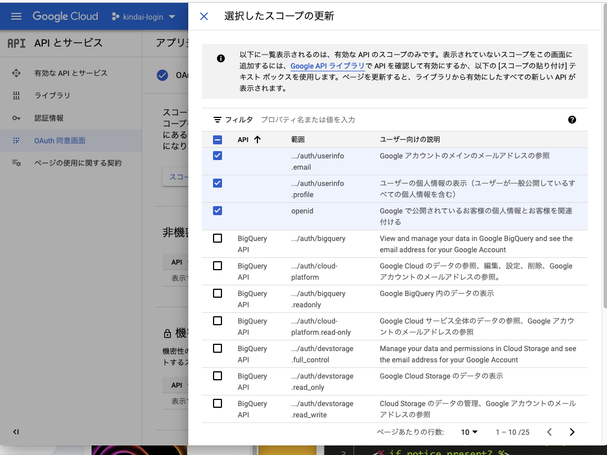

# ネットワークセキュリティ演習 13回  web認証と認可の詳細

最終更新 2022/11/04 Shigeichiro yamasaki

##  演習の目的と概要

* Google Auth で認証／認可するRailsサーバの構築
* Google Auth によるID Token の内容を確認する
* Google OAuth で Google Calender にRailsサーバからアクセスする

## 演習の手順

* 1. 前回のRails Auth の再現
* 2. ID Tokenの内容の確認
* 3. Google photoにsinatraサーバからアクセスする

## システム構成


各自のマシンを利用


## 1. 前回のRails Auth の再現

### rails ディレクトリを削除

★★ もしどこかで問題が発生した場合はここからやりなおしてください．

```bash
$ cd ~/rails
$ rm -fr kindai_login2
```

```bash
$ rails new kindai_login2

$ cd kindai_login2
```
### Gemfile 編集

```bash
$ nano Gemfile
```

gem "rails", "~> 7.0.4"の下に
googleauth を追加


```ruby
...
# Bundle edge Rails instead: gem "rails", github: "rails/rails", branch: "main"
gem "rails", "~> 7.0.4"
gem "googleauth"
...
```

Gemfileのライブラリをインストール

```bash
$ bundle install
```

### User モデルを生成

```bash
$ rails g model User email:string
```


#### User モデルのmigrateファイルを編集

emailカラムにnot null制約とunique制約をかけてデータベースを作成。

★ XXXXXXXXXX  の部分は動的に生成されます．

```bash
$  nano db/migrate/2XXXXXXXXXXXXXXX_create_users.rb 
```

```ruby
class CreateUsers < ActiveRecord::Migration[7.0]
  def change
    create_table :users do |t|
      t.string :email, null: false, index: { unique: true }

      t.timestamps
    end
  end
end
```

#### DB のmigrate

```bash
$ rails db:create
$ rails db:migrate
```

#### User モデルにも制約をかける

```bash
$ nano app/models/user.rb 
```

```ruby
class User < ApplicationRecord
  validates :email, presence: true, uniqueness: true
end
```

### ログイン前とログイン後を識別するためのページのコントローラの生成

```
$ rails g controller StaticPages before_login after_login
```

### before_login.html.erb のビューを編集

```bash
$ nano app/views/static_pages/before_login.html.erb
```

```html
<div>
  <script src="https://accounts.google.com/gsi/client" async defer></script>
  <% if notice.present? %>
    <p id="notice"><%= notice %></p>
  <% end %>
  <h1>ログインしてください</h1>
</div>
```

### after_login.html.erb のビューを編集

```bash
$ nano app/views/static_pages/after_login.html.erb
```

```html
<div>
  <script src="https://accounts.google.com/gsi/client" async defer></script>
  <% if notice.present? %>
    <p id="notice"><%= notice %></p>
  <% end %>
  <h1>ログイン成功</h1>
</div>
```

### Google APIの設定

Google API Consoleへアクセス

[https://console.cloud.google.com/apis](https://console.cloud.google.com/apis)

#### 新しいプロジェクト

* プロジェクト名： kindai-login2
* 組織：   fuk.kindai.ac.jp
* 場所：   fuk.kindai.ac.jp

「作成」ボタンをクリック


####  左側の「OAuth同意画面」を選択（青いバーのプロジェクト名が kindai-login2 にする）

* 「User Type」は「外部」を選択。

「作成」をクリック

#### アプリ登録の編集

 アプリ情報
 
* アプリ名： kindai-login2
* ユーザサポートメール：   ＜自分の近畿大学のメールアドレス＞
* デベロッパーの連絡先情報： ＜自分の近畿大学のメールアドレス＞


「保存して次へ」をクリック


#### スコープの設定

「スコープを追加または削除」をクリック

####  選択したスコープの更新

チェックボックスをつける

* Google アカウントのメインのメールアドレスの参照 
* ユーザーの個人情報の表示（ユーザーが一般公開しているすべての個人情報を含む）
* Google で公開されているお客様の個人情報とお客様を関連付ける 

「更新」ボタンをクリック





「保存して次へ」をクリック


#### テストユーザーに自分のメールアドレスを登録

「ADD users」をクリック

*  ユーザーを追加: ＜自分の近畿大学のメールアドレス＞

「追加」をクリック

「保存して次へ」をクリック

### 左側の「「認証情報」を選択

「＋認証情報を作成」をから「OAuth クライアントID」を選択

#### OAuth クライアント ID の作成 

* アプリケーションの種類： ウェブアプリケーション
* 名前：設定しません

#### 承認済みの JavaScript 生成元

「＋URLを追加」

* URL１： http://localhost

「＋URLを追加」

* URL2： http://localhost:3000

### 認可サーバがアクセストークンをリダイレクトするURLの指定

OAuthのASがRPへ Access Tokenを渡す先です

今回はログインまでです．

#### 承認済みのリダイレクト URI

RPの google login apiのURIを指定します．

「＋URLを追加」

* URL1： http://localhost:3000/google_login_api/callback

「作成」ボタンをクリック

### 「OAuth クライアントを作成しました」というウィンドウがポップアップ

＜クライアントID＞と＜クライアントシークレット＞を大切に保管してください

例

* クライアントID: 477896938142-0i0lhgqag0h6bboqjs62eeasn7ss7580.apps.googleusercontent.com
* クライアントシークレット: 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


### before_login.html.erbのビューを修正

```bash
$ nano app/views/static_pages/before_login.html.erb
```

callback先のURL と ＜自分のクライアントID＞ を設定します．

★この例はログインまでなので，クライアントシークレットは使用しません．

```html
  <script src="https://accounts.google.com/gsi/client" async defer></script>
  <% if notice.present? %>
    <p id="notice"><%= notice %></p>
  <% end %>
  <h1>ログインしてください</h1>
  

  <!-- ここから追加 -->
  <div id="g_id_onload"
    data-client_id="＜自分のクライアントID＞"
    data-login_uri="http://localhost:3000/google_login_api/callback"
    data-auto_prompt="false">
  </div>
  <div class="g_id_signin"
    data-type="standard"
    data-size="large"
    data-theme="outline"
    data-text="sign_in_with"
    data-shape="rectangular"
    data-logo_alignment="left">
  </div>
  <!-- ここまで追加 -->
</div>

```

#### callbackのアクション定義

RPの google login コールバック用のコントローラを生成します．

```bash
$ rails g controller GoogleLoginApi callback
```

#### callbackコントローラの修正

コールバックされたクライアントIDが＜クライアントID＞と等しいことを確認します．

```bash
$ nano app/controllers/google_login_api_controller.rb
```

＜自分のクライアントID>を入れてください

```ruby
class GoogleLoginApiController < ApplicationController
  require 'googleauth/id_tokens/verifier'

  protect_from_forgery except: :callback
  before_action :verify_g_csrf_token

  def callback
    payload = Google::Auth::IDTokens.verify_oidc(params[:credential], aud: '＜自分のクライアントID＞')
    user = User.find_or_create_by(email: payload['email'])
    session[:user_id] = user.id
    # IDトークンをafter_login_pathに渡す
    redirect_to after_login_path
  end

  private

  def verify_g_csrf_token
    if cookies["g_csrf_token"].blank? || params[:g_csrf_token].blank? || cookies["g_csrf_token"] != params[:g_csrf_token]
      redirect_to root_path, notice: '不正なアクセスです'
    end
  end
end
```

###  ルーティングの修正

```bash
$ nano config/routes.rb 
```

以下の3行を追加

  root 'static_pages#before_login'
  get '/after_login', to: 'static_pages#after_login'
  post '/google_login_api/callback', to: 'google_login_api#callback'


```ruby
Rails.application.routes.draw do
  get 'static_pages/before_login'
  get 'static_pages/after_login'
  # Define your application routes per the DSL in https://guides.rubyonrails.org/routing.html

  # 以下3行を追加
  root 'static_pages#before_login'
  get '/after_login', to: 'static_pages#after_login'
  post '/google_login_api/callback', to: 'google_login_api#callback'

  # Defines the root path route ("/")
  # root "articles#index"
end
```

ルーティングを確認する

```bash
$ rails routes


                                  Prefix Verb   URI Pattern                                                                                       Controller#Action
               static_pages_before_login GET    /static_pages/before_login(.:format)                                                              static_pages#before_login
                static_pages_after_login GET    /static_pages/after_login(.:format)                                                               static_pages#after_login
                                    root GET    /                                                                                                 static_pages#before_login
                             after_login GET    /after_login(.:format)                                                                            static_pages#after_login
        turbo_recede_historical_location GET    /
...

```

###  サーバを起動

```bash
$ rails s
```

### ブラウザでアクセス

```
http://localhost:3000
```

表示されるページ


### 近畿大学のgoogle login でログイン

いつもの近畿大学ログインの方法でログインします．

###  ログイン成功を確認する

失敗した場合は最初から


### ctrl-c でサーバーを停止させる


## 2. ID Tokenの内容の確認


### ID Tokenの セキュリティ関連属性

```
iss: 		発行者のURL (https で始まる)
sub:		ユーザ主体の識別子
aud:		ID Tokenの宛先（OAuth 2.0 / OpenID connect のクライアントID)
exp: 		ID Token の有効期限
iat:		JWT 発行時刻
auth_time:	ユーザ認証が最後に発生した時刻
nonce: 		リプレイアタック防止用の乱数
acr:		認証レベルを意味する文字列
amr:		認証手段を意味する文字列
azp:		OAuthクライアントのクライアントid
at_hash:		アクセストークンのハッシュ値の左半分
c_hash:		認可コードのハッシュ値の左半分

```


### ID Tokenの   ユーザ関連基本属性

```
name: 			ID Tokenの対象者の氏名
given_name:		対象ユーザ名
falily_name:			ユーザの氏
middle_name: 		ユーザのミドルネーム
nickname:			カジュアルな呼び名
preferred_username:		ユーザが希望するユーザ名
profile: 			ユーザのプロファイルURL
picture:			ユーザの写真のURL
website:			ユーザのwebサイトのURL
email:			ユーザのemail
email_verified:		ユーザのemailが検証済か？
gender:			ユーザの性別
birthdate:			生年月日
zoneinfo:			タイムゾーン
locale:			ロケール
phone_number:		電話番号
phone_number_verified:	電話番号が確認すみか？
address:			住所
update_at:			最終更新時点

```

### コントローラで ID Token の内容をビューにわたす

```bash
$ nano app/controllers/google_login_api_controller.rb 
```

payload に入っている ID Tokenを `after_login_path` にわたす

`redirect_to after_login_path(payload)`
    
```ruby
class GoogleLoginApiController < ApplicationController
  require 'googleauth/id_tokens/verifier'

  protect_from_forgery except: :callback
  before_action :verify_g_csrf_token

  def callback
    payload = Google::Auth::IDTokens.verify_oidc(params[:credential], aud:
'612206823117-tmqf0bhjqi3gvcaljudlft9o3ql2l21v.apps.googleusercontent.com')
    user = User.find_or_create_by(email: payload['email'])
    session[:user_id] = user.id
# payload に入っている ID Tokenを after_login_pathにわたす
    redirect_to after_login_path(payload)
  end
  
  private
  
  def verify_g_csrf_token
    if cookies["g_csrf_token"].blank? || params[:g_csrf_token].blank? || cookies["g_csrf_token"] !=
params[:g_csrf_token]
      redirect_to root_path, notice: '不正なアクセスです'
    end
  end
end
```

### `after_login_path`のビューの修正

ID Tokenの内容を表示させる

```bash
$ nano app/views/static_pages/after_login.html.erb 
```

```ruby

<div>
  <script src="https://accounts.google.com/gsi/client" async defer></script>
  <% if notice.present? %>
    <p id="notice"><%= notice %></p>
  <% end %>
  <h1>ログイン成功しました</h1>
  
<h2>ID token</h2>
<UL>
<li>"iss":      <%=params["iss"] %></li>
<li>"sub":      <%=params["sub"] %></li>
<li>"aud":      <%=params["aud"] %></li>
<li>"exp":      <%=params["exp"] %></li>
<li>"iat":      <%=params["iat"] %></li>
<li>"nonce":    <%=params["nonce"] %></li>
<li>"acr":      <%=params["acr"] %></li>
<li>"amr":      <%=params["amr"] %></li>
<li>"at_hash":  <%=params["at_hash"] %></li>
<li>"c_hash":   <%=params["c_hash"] %></li>

<li>"name":     <%=params["name"] %></li>
<li>"given_name":       <%=params["given_name"] %></li>
<li>"family_name":      <%=params["family_name"] %></li>
<li>"middle_name":      <%=params["middle_name"] %></li>
<li>"nickname":      <%=params["nickname"] %></li>
<li>"preferred_username":      <%=params["preferred_username"] %></li>
<li>"profile":      <%=params["profile"] %></li>
<li>"picture":  <%=params["picture"] %></li>
<li>"website":  <%=params["website"] %></li>
<li>"email":    <%=params["email"] %></li>
<li>"email_verified":   <%=params["email_verified"] %></li>
<li>"gender":   <%=params["gender"] %></li>
<li>"birthdate":        <%=params["birthdate"] %></li>
<li>"zoneinfo": <%=params["zoneinfo"] %></li>
<li>"locale":   <%=params["locale"] %></li>
<li>"phone_number":   <%=params["phone_number"] %></li>
<li>"phone_number_verified":   <%=params["phone_number_verified"] %></li>
<li>"address":      <%=params["address"] %></li>
<li>"azp":      <%=params["azp"] %></li>
<li>"nbf":      <%=params["nbf"] %></li>
<li>"hd":       <%=params["hd"] %></li>
</UL>

<h3>写真</h3>
  <p>></p>
  
</div>


```


## 3. 3. Google photoにsinatraサーバからアクセスする

Rails では手順が複雑になるので，シンプルな web アプリケーションフレームワークの sinatora を利用します．


#### ライブラリインストール


```bash
$ gem install puma
$ gem install sinatra
$ gem install google-api-client
```

警告が出ますが，気にしないことにします．

```bash
$ cd ~
$ bundle init

$ nano Gemfile
```

Gemfileの内容を消して，以下のようにします．

```ruby
gem "sinatra"
gem "google-api-client"
```

```bash
$ bundle install 
```

### Google Photos API の有効化

[REST スタートガイド](https://developers.google.com/photos/library/guides/get-started)

* 「Google Photos Library APIを有効にする」 をクリック

* Enable Photos Library API のプロジェクトとして，プルダウンメニューから「kindai-login2」を選択
* NEXT
* プルダウンメニューで「web browser」を選択して「CREATE」
* CORS 入力しないでよい
* 「DOWNLOAD CLIENT CONFIGURATION」は無視してかまいません
* DONE

### OAuth クライアントの確認/クレデンシャルの取得


[Google API Consoleへアクセス](https://console.cloud.google.com/apis)

青いバーで，プロジェクトが「kindai-login2」であることを確認

####「認証情報」を選択

* OAth client が追加されていることを確認
* 名前を「google photo client」にする
* 承認済みのリダイレクト URIを「http://localhost:9292/redirect」
* 上部の「JSONをダウンロード」をクリックしてファイルを自分のホームディレクトリにダウンロードします，そのときファイル名を「client_secrets.json」にします．
* 「保存」をクリック


#### OAuth同意画面の確認

* テストユーザなどを確認

### アプリの作成

```bash
$ nano config.ru
```

```ruby
require './app'
run TestWebApp
```

```bash
$ nano app.rb
```

```ruby
require 'sinatra/base'
require 'google/api_client/client_secrets'
require 'json'
require 'net/https'

class TestWebApp < Sinatra::Base
  enable :sessions

  before do
    client_secrets = Google::APIClient::ClientSecrets.load
    @auth_client = client_secrets.to_authorization
  end

  get '/' do
    @auth_client.update!(
      :redirect_uri => 'http://localhost:9292/redirect',
      :scope => [
        'https://www.googleapis.com/auth/photoslibrary.readonly',
        'https://www.googleapis.com/auth/photoslibrary.readonly.appcreateddata'
      ]
    )
    auth_uri = @auth_client.authorization_uri.to_s
    redirect auth_uri
  end

  get '/redirect' do
    @auth_client.code = request['code']
    @auth_client.fetch_access_token!
    auth_client = Signet::OAuth2::Client.new(JSON.parse(@auth_client.to_json))
    session[:token] = auth_client.access_token
    redirect '/list'
  end

  get '/list' do
    uri = URI.parse 'https://photoslibrary.googleapis.com/v1/albums'
    http = Net::HTTP.new(uri.host, uri.port)
    http.use_ssl = true
    req = Net::HTTP::Get.new uri.request_uri
    req['Content-type'] = 'application/json'
    req['Authorization'] = "Bearer #{session[:token]}"
    res = http.request req
    @albums = JSON.parse(res.body)
    @token = session[:token]
    erb :list
  end

  get '/:album_id/list' do
    uri = URI.parse 'https://photoslibrary.googleapis.com/v1/mediaItems:search'
    http = Net::HTTP.new(uri.host, uri.port)
    http.use_ssl = true
    req = Net::HTTP::Post.new uri.request_uri
    req['Content-type'] = 'application/json'
    req['Authorization'] = "Bearer #{session[:token]}"
    req.body = { 
      "pageSize" => "100",
      "albumId" => params['album_id']
    }.to_json
    res = http.request req
    @media_items = JSON.parse(res.body)
    erb :items
  end

end

```

```bash
$ mkdir views/
```

```bash
$ nano views/list.erb
```

```html
<html>
  <head>
    <title>test web app</title>
  </head>
  <body>
    <h1>Albums</h1>
    <ul>
      <% @albums['albums'].each do |album| %>
        <li><a href="/<%= album['id'] %>/list"><%= album['title'] %></a></li>
      <% end %>
    </ul>
    <h2>アクセストークン</h2>
      <pre><%= session[:token] %></pre>
  </body>
</html>
```

```bash
$ nano views/items.erb
```

```html
<html>
  <head>
    <title>test web app</title>
  </head>
  <body>
    <h1>MediaItems</h1>
    <ul>
      <% @media_items['mediaItems'].each do |item| %>
        <li><a href="<%= item['productUrl'] %>" target="_blank"><%= item['filename'] %></a></li>
      <% end %>
    </ul>
  </body>
</html>
```

### 動作確認

#### サーバー起動

```bash
$ rackup config.ru
```

#### ブラウザでアクセス

```
http://localhost:9292
```

* 認証画面で自分を選択
* 「許可」をクリック
* 選択内容を確認する
